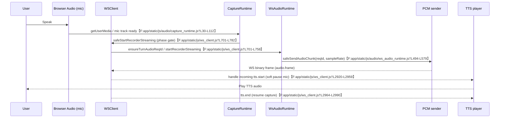

# AskChip Client Conversational Flow — v2

## Overview
The frontend orchestrates greet playback, mic/PCM/VAD gating, and WS interaction for AskChip. Behavior below reflects the current code paths only.

## State & Phase Model (Client)
- `PHASE` enum covers `boot → greet → conversation_ready → user_turn → closing → closed`; `createVoicePhaseController` drives transitions and logs changes.【F:app/static/js/voice/phase_controller.js†L1-L60】
- `markGreetStart` warms the AudioContext, tracks greet `utt_id`, sets `PHASE.Greet`, disables barge-in, pauses PCM, and stops mic capture.【F:app/static/js/ws_client.js†L472-L559】
- `markGreetEnd` moves to `ConversationReady`, then asynchronously reacquires mic hardware, ensures the audio graph, re-enables the mic track, flags mic/PCM readiness, and schedules the conversation start timer.【F:app/static/js/ws_client.js†L561-L588】
- `safeStartRecorderStreaming` is hard-gated to `ConversationReady/UserTurn`; all other phases log and return `false`.【F:app/static/js/ws_client.js†L701-L782】

## Lifecycle: Full Client Conversational Flow

See the timeline below for the concrete call/phase order that the current implementation follows.

### Boot / Page Load
- `app.js` initializes telemetry bridge, ensures `window.AppState`, and pre-sets `AppState.phase` to `"greet"` for gating compatibility. Audio modules load first so capture/ws runtimes are available to later dynamic imports.【F:app/static/js/app.js†L24-L199】

### User Start / Connect
- Mic hardware is warmed by `ensureMicHardware` when invoked (tracks Ready/Failed states, disables track until ready). Repeated calls reuse a live track; failures emit `client.mic.hardware_failed`.【F:app/static/js/audio/capture_runtime.js†L7-L112】
- The WS audio runtime queues PCM until `req_id` is set; `safeSendAudioChunk` drops sends when `phase === greet` or no active turn ID, logging `client.audio_chunk_dropped`.【F:app/static/js/audio/ws_audio_runtime.js†L494-L540】

### Greet Phase (Client)
- Greet start detection accepts `greet.*` frames or `tts.start` with `meta.is_greet`; `markGreetStart` warms audio, pauses PCM, disables barge-in, and stops recorder (`stopRecorderStreaming`/`autoStopRecorder`).【F:app/static/js/ws_client.js†L431-L559】
- During greet, PCM send is blocked by `safeSendAudioChunk` and capture acquisition checks `isGreetPhase` (gated in callers like `safeStartRecorderStreaming`).【F:app/static/js/audio/ws_audio_runtime.js†L494-L504】【F:app/static/js/ws_client.js†L701-L782】

### Greet → ConversationReady Transition (Client)
- `markGreetEnd` triggers mic reacquire: `ensureMicHardware()` → `ensureAudioGraph("greet_to_conversation_ready")` → `markMicAndPcmReady("audio_graph_live")` → mic track `enabled = true`; then `scheduleConversationStartAfterGreet` arms entry into conversation.【F:app/static/js/ws_client.js†L561-L588】

### Conversation Phase (Full Duplex)
- `enterConversationAfterGreet` commits when WS ready + ASR ready, forcing phase to `UserTurn` and syncing AppState; otherwise retries until ready.【F:app/static/js/ws_client.js†L784-L895】
- `safeRequestAsrOpen` only proceeds in conversation phases and forwards `requestAsrArm/openAsr` calls, logging intent/skip reasons.【F:app/static/js/ws_client.js†L641-L699】
- Mic start: `safeStartRecorderStreaming` enforces phase gate, then calls `ensureTurnAudioReqId` and `WSClient.startRecorderStreaming`; AppState.listening is toggled in runtime (via WSClient) once capture begins.【F:app/static/js/ws_client.js†L701-L782】
- PCM sender: `ws_audio_runtime` requires an active `req_id`; chunks include reqId/sampleRate metadata, and missing IDs cause drops to avoid orphan audio.【F:app/static/js/audio/ws_audio_runtime.js†L494-L540】
- VAD + barge-in: `canBargeIn` mirrors conversation phases. VAD event handling in capture_runtime (not shown here) drives `senderPaused` and auto-stop policies tied to AppState phase.

### ASR & Turn Handling
- `safeRequestAsrOpen` and phase checks gate ASR open; ASR readiness (`AppState.asrReady`) is awaited before committing `enterConversationAfterGreet`, ensuring turn capture opens post-greet.【F:app/static/js/ws_client.js†L641-L699】【F:app/static/js/ws_client.js†L784-L846】
- PCM flow requires `getCurrentTurnReqId`; drops otherwise, preventing ASR feed without server-issued turn IDs.【F:app/static/js/audio/ws_audio_runtime.js†L494-L538】

### Error Handling & Reacquire
- Mic failures mark hardware state `Failed` and log `client.mic.hardware_failed`; reconnection calls `ensureMicHardware` again, verifying live tracks and resetting state if tracks died.【F:app/static/js/audio/capture_runtime.js†L30-L112】

### Session End / Cleanup
- Recorder stop is invoked on greet start and other gating paths; PCM sender pauses via `setSenderPauseReason` and graph readiness flags gate further start attempts.【F:app/static/js/ws_client.js†L472-L559】

### Echo / Feedback Prevention (Client)
- `guard_mic_monitor.js` patches `AudioNode.connect` to trace mic-fed paths and block any connection from mic sources to audible destinations, logging `mic_guard.block` and emitting `client.mic_monitor_blocked`. It also propagates mic lineage across downstream nodes.【F:app/static/js/audio/guard_mic_monitor.js†L4-L254】
- Media elements assigned mic streams are auto-muted (`muted=true`, `volume=0`) to prevent local echo.【F:app/static/js/audio/guard_mic_monitor.js†L264-L329】

## End-to-End Timeline (As Implemented)

1. **User hits Start** — The Start button click handler mints a token, validates login/profile, and calls `WSClient.open` to kick off the session.【F:app/static/js/app.js†L1891-L1978】 _(Initiator: client; Phase: boot→greet)_
2. **WS `/ws/v2/chat` connect** — The client opens the chat socket with subprotocols `chat.v2` and `jwt.*`; the adapter singleton is created server-side in `_get_adapter`. Logs: `evt=ws_open_attempt`, `ws.open_and_greet`.【F:app/static/js/app.js†L1953-L1979】【F:app/asgi_gateway.py†L1107-L1116】【F:app/ws/adapter.py†L7170-L7188】 _(Initiator: client→server; Phase: greet)_
3. **Greet start (client + server views)** — Server emits `greet.start` / `tts.start` with `meta.is_greet`; client detects via `frameSignalsGreetStart` and `markGreetStart`, logging `client.phase.greet_start` and pausing capture/PCM.【F:app/ws/adapter.py†L1322-L1359】【F:app/static/js/ws_client.js†L431-L559】 _(Initiator: server; Phase: greet)_
4. **Greet end** — Server marks greet completion on `tts.end`/`greet.complete`, logging `greet.completed`/`server.greet_complete` and sending `greet.complete` to the client; client `frameSignalsGreetEnd` → `markGreetEnd` transitions to `ConversationReady`.【F:app/ws/adapter.py†L1399-L1539】【F:app/static/js/ws_client.js†L442-L588】 _(Initiator: server; Phase: greet→conversation_ready)_
5. **ASR open / `asr_ready_bundle`** — `_ensure_asr_ready` arms `_open_asr` post-greet and emits the ASR ready bundle (`asr.ready` + `input.start` + `start_listening`), logging `asr_ready_emit/asr_ready_after_greet`.【F:app/ws/adapter.py†L1214-L1289】 _(Initiator: server; Phase: conversation_ready)_
6. **ConversationReady / UserTurn** — Client polls readiness in `enterConversationAfterGreet`, committing `voicePhaseController.enterConversation` when WS + ASR are ready and logging `client.conversation.user_turn_commit`.【F:app/static/js/ws_client.js†L784-L850】 _(Initiator: client; Phase: conversation_ready→user_turn)_
7. **First user utterance → ASR → LLM → TTS** — Mic capture starts via `safeStartRecorderStreaming` (phase-gated, ensures `req_id`), PCM is sent by `safeSendAudioChunk` (logs `client.audio_chunk_send`). Server ingests binary frames as `audio.frame.received`, rejects if greet incomplete, routes to ASR; `_handle_asr_result` publishes `asr.final`, forwards to EngineV2 `on_asr_final`, which emits NLU/policy and drives TTS frames that the client plays via `handleTtsStart/handleTtsEnd`.【F:app/static/js/ws_client.js†L701-L782】【F:app/static/js/audio/ws_audio_runtime.js†L494-L579】【F:app/ws/adapter.py†L3964-L3991】【F:app/ws/adapter.py†L7586-L7772】【F:app/voice_v2/engine.py†L629-L713】【F:app/static/js/ws_client.js†L2920-L2990】 _(Initiator: client speech → server processing; Phase: user_turn→responding)_
8. **Turn end** — Adapter ends turn on ASR timeout/`turn.empty` or after final handling, invoking `_end_user_turn` / `turn.stop` paths (telemetry `client_turn_stop`); client resumes capture gating via VAD/phase after TTS end.【F:app/ws/adapter.py†L3940-L3963】【F:app/ws/adapter.py†L7790-L7820】【F:app/static/js/ws_client.js†L2920-L2990】 _(Initiator: server; Phase: closing user turn)_
9. **Session close** — User clicks End or socket closes; client calls `WSClient.close`/`requestAsrClose`, server `_close_asr` and WS close handlers tear down; AppState set to `closing/closed`.【F:app/static/js/app.js†L1992-L2013】【F:app/ws/adapter.py†L3944-L3963】 _(Initiator: client or server; Phase: closing→closed)_

## Client-side View of One Turn (Post-Greet)

## Troubleshooting by Symptom (Client)

### Chip greets, but I can't respond
- **What to look for in CL logs**: confirm `client.phase.greet_end` followed by `client.phase.conversation_ready`/`client.conversation.user_turn_commit`. Missing `client.mic_pcm.ready` or `client.mic.hardware_unmute` means the mic graph never re-enabled post-greet.
- **Likely causes**: `markGreetEnd` might not finish mic reacquire/graph setup, leaving `AppState.phase` stuck at `greet` or `conversation_ready` without advancing; `safeStartRecorderStreaming` hard-gates to conversation phases and logs `client.mic.start_blocked` when `PHASE` is not ready.【F:app/static/js/ws_client.js†L561-L895】【F:app/static/js/ws_client.js†L701-L782】
- **Key files/functions to inspect**: `ws_client.markGreetEnd` (mic reacquire + graph ready), `ws_client.enterConversationAfterGreet` (phase commit retries), `ws_client.safeStartRecorderStreaming` (phase gate before capture).【F:app/static/js/ws_client.js†L561-L895】【F:app/static/js/ws_client.js†L701-L782】
- **Sanity checks**: verify `AppState.phase === "user_turn"` before pressing Start, ensure `micTrack.enabled` is `true` after greet, and that `AppState.asrReady` is `true` (conversation gate).【F:app/static/js/ws_client.js†L561-L895】

### I hear my own voice / echo
- **What to look for in CL logs**: `mic_guard.block` or `client.mic_monitor_blocked` entries indicate mic-to-output paths were detected and blocked; absence of these logs during playback suggests the guard was not active.【F:app/static/js/audio/guard_mic_monitor.js†L4-L329】
- **Likely causes**: `guard_mic_monitor` may not have patched node connections before a custom node graph connected mic sources to an audible destination, or a media element received the mic stream without auto-muting.【F:app/static/js/audio/guard_mic_monitor.js†L4-L329】
- **Key files/functions to inspect**: `audio/guard_mic_monitor.js` (AudioNode.connect interception, mic lineage tracking, auto-mute on media elements).【F:app/static/js/audio/guard_mic_monitor.js†L4-L329】
- **Sanity checks**: confirm the guard is imported/executed prior to mic graph creation, and inspect the console for `client.mic_monitor_blocked` during any echo incident to ensure the path was blocked.【F:app/static/js/audio/guard_mic_monitor.js†L4-L329】

### Mic never starts / no input
- **What to look for in CL logs**: `client.mic.start_blocked` (phase gate), `client.mic.start_failed`/`client.mic.gum_failed` (getUserMedia failure), absence of `client.mic.stream_success`/`client.mic.opened` after Start. `client.mic.start_retry_scheduled` indicates the runtime is looping to retry mic start.【F:app/static/js/ws_client.js†L701-L782】【F:app/static/js/audio/capture_runtime.js†L914-L1023】
- **Likely causes**: running start while `PHASE` is still `greet`/`conversation_ready` (blocked in `safeStartRecorderStreaming`); hardware acquisition errors in `ensureMicHardware`/`startRecorderStreaming`; capture runtime bails when `getUserMedia` rejects and logs `gum_failed`.【F:app/static/js/ws_client.js†L701-L782】【F:app/static/js/audio/capture_runtime.js†L30-L112】
- **Key files/functions to inspect**: `ws_client.safeStartRecorderStreaming` (phase + turn gating), `audio/capture_runtime.ensureMicHardware` and `startRecorderStreaming` (GUM + track enable), `audio/ws_audio_runtime.safeSendAudioChunk` (drops PCM if no `req_id`).【F:app/static/js/ws_client.js†L701-L782】【F:app/static/js/audio/capture_runtime.js†L30-L112】【F:app/static/js/audio/ws_audio_runtime.js†L494-L540】
- **Sanity checks**: confirm `PHASE` is `user_turn`, `AppState.listening` becomes true, the media `MicTrack.enabled` toggles true after `markGreetEnd`, and that `AppState.audioGraphReady`/`AppState.micReady` are true (set by `markMicAndPcmReady`).【F:app/static/js/ws_client.js†L561-L895】

### Random "gum_failed" or repeated mic retries
- **What to look for in CL logs**: `client.mic.gum_failed`, `client.mic.capture_retry_due_to_gum_failed`, `client.mic.reacquire.*` (sender replace, recreate AudioContext).【F:app/static/js/audio/ws_audio_runtime.js†L223-L309】【F:app/static/js/audio/ws_audio_runtime.js†L1305-L1307】
- **Likely causes**: `getUserMedia` rejection inside `capture_runtime.startRecorderStreaming`, or sender errors triggering `ws_audio_runtime.reacquireMic`. Retries are scheduled when capture returns `gum_failed` or sender replacement fails.【F:app/static/js/audio/capture_runtime.js†L914-L1023】【F:app/static/js/audio/ws_audio_runtime.js†L223-L309】
- **Key files/functions to inspect**: `capture_runtime.startRecorderStreaming` (GUM request, emits gum failure logs), `ws_audio_runtime.reacquireMic` (retry loop and AudioContext recreation), `ws_audio_runtime.safeStartRecorderStreaming` caller path when retries are scheduled.【F:app/static/js/audio/capture_runtime.js†L914-L1023】【F:app/static/js/audio/ws_audio_runtime.js†L223-L309】【F:app/static/js/ws_client.js†L701-L782】
- **Sanity checks**: verify constraints passed to `getUserMedia`, ensure prior mic tracks are stopped before retry, and confirm `senderPaused`/`AppState.phase` are not blocking capture when retries fire.【F:app/static/js/audio/capture_runtime.js†L914-L1023】【F:app/static/js/audio/ws_audio_runtime.js†L494-L540】

### Audio cuts off mid-turn
- **What to look for in CL logs**: sudden `client.mic.stopped` from capture runtime, `client.mic.start_retry_scheduled`, or PCM sender drops (`client.audio_chunk_dropped`). TTS handling logs (`tts.start` with mic pause) can precede auto-stops during server speech.【F:app/static/js/audio/capture_runtime.js†L782-L1218】【F:app/static/js/audio/ws_audio_runtime.js†L494-L579】【F:app/static/js/ws_client.js†L2920-L2990】
- **Likely causes**: VAD/phase auto-stop from capture runtime, TTS start pausing capture (`handleTtsStart` uses `pauseRecorder`/sender pause), or turn closing (`client_turn_stop` server event) driving `_autoStopRecorder`/`stopRecorderStreaming`. PCM drops also occur if `req_id` is missing or phase regresses from `user_turn`.【F:app/static/js/ws_client.js†L2920-L2990】【F:app/static/js/ws_client.js†L701-L782】【F:app/static/js/audio/ws_audio_runtime.js†L494-L579】
- **Key files/functions to inspect**: `capture_runtime._stopRecorder` (`client.mic.stopped` reasons), `ws_client.handleTtsStart/handleTtsEnd` (mic pause/resume around TTS), `ws_audio_runtime.safeSendAudioChunk` (phase/req gates).【F:app/static/js/audio/capture_runtime.js†L782-L1218】【F:app/static/js/ws_client.js†L2920-L2990】【F:app/static/js/audio/ws_audio_runtime.js†L494-L579】
- **Sanity checks**: confirm `AppState.phase` remains `user_turn` during the cut, `AppState.listening` stays true, and `senderPaused` flags clear after TTS ends; verify `client.phase.*` logs show no regression to greet/closing mid-turn.【F:app/static/js/ws_client.js†L2920-L2990】【F:app/static/js/ws_client.js†L561-L850】

## Utopia Client Conversational Architecture
- Deterministic phases where greet fully gates mic/PCM/VAD/ASR; conversation entry only after explicit greet-end + ASR-ready handshake.
- Mic lifecycle: single warm-up, graph reuse across turns, deterministic unmute when conversation starts; no out-of-phase capture attempts.
- VAD/PCM gating: PCM only when `req_id` active and ASR open; VAD toggles senderPaused/barge-in with explicit policies; TTS cancel cleanly interrupts playback and re-arms capture.
- Echo control: mic sources can never reach `AudioDestinationNode`; only TTS/output nodes feed speakers.

## Gap Analysis: Client (As Implemented vs Utopia)
- **Match**: Phase enum and greet gating exist; PCM send blocked during greet; mic guard blocks feedback paths; mic reacquire after greet warms graph before conversation.【F:app/static/js/voice/phase_controller.js†L1-L60】【F:app/static/js/audio/ws_audio_runtime.js†L494-L504】【F:app/static/js/audio/guard_mic_monitor.js†L4-L254】【F:app/static/js/ws_client.js†L561-L588】
- **Partial**: Conversation commit retries on readiness but relies on timers; VAD/barge-in control referenced via `canBargeIn` without centralized VAD policy description here; ASR readiness depends on AppState flags external to this module.【F:app/static/js/ws_client.js†L630-L895】
- **Mismatch**: No explicit hard gate preventing warm-up recorder attempts beyond phase check; greet start relies on frame detection and may miss if metadata absent; detailed VAD-to-senderPaused mapping not consolidated for deterministic barge-in timing.
