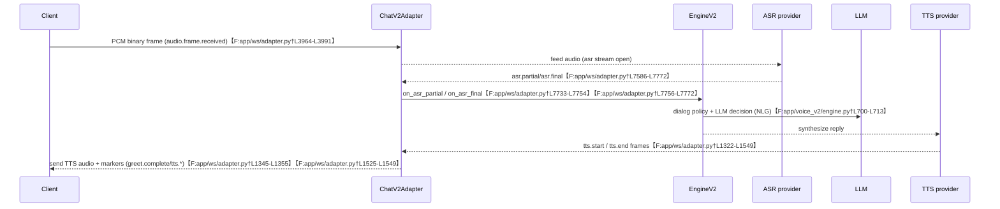

# AskChip Server Conversational Flow — v2

## Overview
ChatV2Adapter coordinates WS lifecycle, greet orchestration, ASR/LLM/TTS, and telemetry. This document describes the current behavior with code references.

## State & Session Model (Server)
- `_AdapterContext` holds per-connection state: ASR gates, greet completion, audio acceptance, turn indices, VAD hints, and tracking flags (e.g., `greet_completed`, `accepting_audio`, `asr_ready_bundle_sent_ms`, `turn_req_id`).【F:app/ws/adapter.py†L600-L752】
- Engine/adapter maintain `turn_index` and `turn_req_id` on the context for correlating ASR/LLM/TTS events.【F:app/ws/adapter.py†L600-L706】

## Lifecycle: Full Server Conversational Flow

See the implemented timeline below for the concrete ordering of adapter/engine steps.

### WS Open & Handshake
- `asgi_gateway` instantiates `ChatV2Adapter`/`EngineV2` and routes `/ws/v2/chat` connections to the adapter singleton.【F:app/asgi_gateway.py†L1107-L1169】
- `_on_open_and_greet` runs on connection: logs `ws.open_and_greet`, invokes engine `on_open`, then `start_greet`, and clears `await_user_*` flags to avoid premature re-arm.【F:app/ws/adapter.py†L7170-L7188】

### Greet Generation & TTS
- TTS start handling marks frames with `meta.is_greet` when `_frame_signals_greet` matches, emits `greet.start`, and records `greet_utt_id` for completion tracking.【F:app/ws/adapter.py†L1322-L1362】
- TTS end detects greet completion via markers or tracked `greet_utt_id`, emits `greet.completed/server.greet_complete`, and sends `greet.complete` frame to the client; greet completion also triggers ASR-ready arm when bundle not yet sent.【F:app/ws/adapter.py†L1453-L1539】

### Greet → ConversationReady (Server)
- After greet completion, `_ensure_asr_ready` runs once to emit ASR readiness; pre-greet ASR open attempts are suppressed with `asr_ready_suppressed_during_greet` logging.【F:app/ws/adapter.py†L1235-L1283】【F:app/ws/adapter.py†L1537-L1539】

### ASR Streaming & Turn Handling
- Incoming PCM frames publish `audio.frame.received`; if greet not complete, server rejects audio with `audio_not_expected` and closes frame handling.【F:app/ws/adapter.py†L3965-L3990】
- ASR state flags (`asr_open`, `asr_ready`, timers, watchdogs) reside on the context; accepting_audio governs ingestion and rate limits in the same structure.【F:app/ws/adapter.py†L600-L646】

### LLM & TTS Responses
- TTS start/end events log provider/utt metadata and update session metrics; greet detection piggybacks on these handlers as above.【F:app/ws/adapter.py†L1322-L1522】
- Engine-driven TTS uses ElevenLabs by default via provider metadata in emitted frames.【F:app/ws/adapter.py†L1322-L1337】

### Barge-in / Interrupt Handling
- Context tracks `client_vad_*` signals and `await_user_*` flags, but no explicit server-side barge-in cancelation logic is visible in these sections; output truncation is not triggered by client interrupts in the shown code.【F:app/ws/adapter.py†L676-L720】

### Error Handling / Disconnects
- Audio ingestion rejects over-limit frames with `frame_too_large` errors; greet-phase PCM causes `audio_not_expected`. The context includes multiple watchdog timers (`no_audio_watchdog`, `asr_ready_deadline_task`) to cancel on errors.【F:app/ws/adapter.py†L3965-L4010】【F:app/ws/adapter.py†L600-L706】

### Logging & Telemetry
- Adapter emits `session_step` events such as `ws.open_and_greet`, `audio.frame.received`, `greet.start/complete`, and TTS markers for downstream telemetry.【F:app/ws/adapter.py†L1322-L1539】【F:app/ws/adapter.py†L3965-L3990】【F:app/ws/adapter.py†L7170-L7180】
- Logging noise is tuned globally in `asgi_gateway` with `tune_logging_noise()` and per-category log levels for ws/auth/tts modules.【F:app/asgi_gateway.py†L45-L67】

## End-to-End Timeline (As Implemented)

1. **User hits Start** — Client click handler mints a WS token and opens `/ws/v2/chat` with `chat.v2` + JWT subprotocols; adapter singleton is constructed via `_get_adapter`. Telemetry: `evt=ws_open_attempt`.【F:app/static/js/app.js†L1891-L1979】【F:app/asgi_gateway.py†L1107-L1116】 _(Initiator: client; Phase: connect/greet)_
2. **WS `/ws/v2/chat` connect** — ASGI gateway routes the socket to `ChatV2Adapter`; `_on_open_and_greet` logs `ws.open_and_greet`, invokes `EngineV2.on_open`, and immediately calls `start_greet`.【F:app/ws/adapter.py†L7170-L7188】【F:app/voice_v2/engine.py†L252-L270】 _(Initiator: server; Phase: greet)_
3. **Greet start (TTS)** — Engine emits TTS greet; adapter `_handle_tts_start` tags `meta.is_greet`, records `greet_utt_id`, and publishes `tts.start/greet.start`.【F:app/ws/adapter.py†L1322-L1362】 _(Initiator: server; Phase: greet)_
4. **Greet end** — On `tts.end`, adapter matches `greet_utt_id`, emits `greet.completed` + `server.greet_complete`, and sends `greet.complete` to the client; if greet just finished, it calls `_ensure_asr_ready` and logs `server.conversation_ready`.【F:app/ws/adapter.py†L1399-L1549】 _(Initiator: server; Phase: greet→conversation_ready)_
5. **ASR open / `asr_ready_bundle`** — `_ensure_asr_ready` defers pre-greet attempts, schedules `_open_asr`, waits for the open task, then emits `asr.ready` + `input.start` + `start_listening` via `_send_asr_ready_bundle`. Telemetry: `asr_ready_emit`, `asr_ready_after_greet`.【F:app/ws/adapter.py†L1214-L1289】 _(Initiator: server; Phase: conversation_ready)_
6. **ConversationReady/UserTurn arm** — Adapter logs `server.conversation_ready` when ASR ready follows greet, and will send `turn.begin` if no turn is active post-greet to allow mic streaming.【F:app/ws/adapter.py†L1524-L1556】 _(Initiator: server; Phase: conversation_ready)_
7. **First user utterance → ASR ingest** — Binary PCM arrives as `_handle_binary` (`audio.frame.received`); greet-incomplete frames are rejected with `audio_not_expected`. ASR results flow into `_handle_asr_result`, which publishes `asr.partial`/`asr.final` session steps and defers policy to Engine.【F:app/ws/adapter.py†L3964-L3991】【F:app/ws/adapter.py†L7586-L7772】 _(Initiator: client audio; Phase: user_turn)_
8. **LLM + dialog policy** — EngineV2 consumes `asr.final` via `on_asr_final`, records `turn_id/req_id`, emits NLU, and drives policy/NLG selection before TTS synthesis begins.【F:app/voice_v2/engine.py†L629-L713】 _(Initiator: server; Phase: thinking→responding)_
9. **TTS synthesis + playback** — Engine streams TTS PCM through adapter `_handle_tts_start/_handle_tts_end`, publishing `tts.start/tts.end` session steps and pushing audio frames back to the client. Greet completion and conversation-ready logging live in these handlers.【F:app/ws/adapter.py†L1322-L1549】 _(Initiator: server; Phase: responding)_
10. **Turn end** — Empty finals/timeouts trigger `turn.empty` and `_end_user_turn`; final handling logs `client_turn_stop` and closes ASR as needed.【F:app/ws/adapter.py†L3940-L3963】【F:app/ws/adapter.py†L7790-L7820】 _(Initiator: server; Phase: closing)_
11. **Session close** — Client end button or network close drives `_close_asr` and socket teardown; adapter error paths propagate close codes (`audio_not_expected`, `frame_too_large`).【F:app/static/js/app.js†L1992-L2013】【F:app/ws/adapter.py†L3980-L4003】 _(Initiator: client/server; Phase: closed)_

## Server-side View of One Turn (Post-Greet)

## Troubleshooting by Symptom (Server)

### ASR never returns text (empty_final_timeout)
- **Relevant SL log patterns**: `evt=asr.timeout` warns when `_handle_asr_timeout` promotes a final due to inactivity; `_handle_asr_result` then records `turn_empty` with `skip_reason=empty_final_timeout` when the transcript is empty and marked as timeout.【F:app/ws/adapter.py†L1008-L1044】【F:app/ws/adapter.py†L7760-L7807】
- **Likely code paths / conditions**: ASR stream opened but no audio or partials cause `_log_asr_timeout` → `_handle_asr_result` with `promoted_final=True` and empty text, short-circuiting LLM dispatch and ending the turn.【F:app/ws/adapter.py†L1008-L1044】【F:app/ws/adapter.py†L7760-L7807】
- **Timeout configuration**: ` _DIAG_NO_AUDIO_CHECK_DELAY_SECONDS` and `_MIC_OPEN_TIMEOUT_SECONDS` govern the no-audio watchdog and mic-open timeout used by `_schedule_no_audio_watchdog_rearm` after `audio.header` is received.【F:app/ws/adapter.py†L144-L148】【F:app/ws/adapter.py†L3499-L3536】【F:app/ws/adapter.py†L6609-L6699】
- **Invariants to check**: ensure `audio.header` arrived (arms watchdog) and `ctx.greet_completed` is true so ASR ready bundle is allowed; verify no `asr_no_audio_after_header` warnings indicating the watchdog fired without input.【F:app/ws/adapter.py†L1399-L1556】【F:app/ws/adapter.py†L6650-L6699】

### Audio arrives during greet
- **Relevant SL log patterns**: `_handle_binary` logs `audio.frame.received` then replies with `audio_not_expected` and closes with code `1003` when `greet_completed` is false.【F:app/ws/adapter.py†L3944-L4010】
- **Likely code paths / conditions**: any PCM frame before `greet_completed=True` triggers the rejection, preventing ASR feed and forcing socket close with the error code `audio_not_expected`. Greet completion is only set in `_handle_tts_end` when greet metadata matches the tracked `greet_utt_id`.【F:app/ws/adapter.py†L1399-L1539】【F:app/ws/adapter.py†L3944-L4010】
- **Invariants to check**: `greet_completed` must be true before accepting audio; verify `greet.start`/`greet.completed` logs exist and that the client respected `greet.complete` before streaming PCM.【F:app/ws/adapter.py†L1322-L1539】【F:app/ws/adapter.py†L3944-L4010】

### Greet never transitions to conversation
- **Relevant SL log patterns**: absence of `greet_completed/server.greet_complete` or `server.conversation_ready`, plus suppressed logs like `asr_ready_suppressed_during_greet` if ASR open was attempted too early.【F:app/ws/adapter.py†L1235-L1283】【F:app/ws/adapter.py†L1399-L1556】
- **Likely code paths / conditions**: `_handle_tts_end` fails to mark `greet_completed` if `meta.is_greet` or `greet_utt_id` do not match; `_ensure_asr_ready` skips until greet completion, so ASR ready bundle and `turn.begin` never fire.【F:app/ws/adapter.py†L1235-L1283】【F:app/ws/adapter.py†L1399-L1556】
- **Pointers to configuration/gates**: greet detection lives in `_frame_signals_greet`; ASR ready gating depends on `ctx.greet_completed` before emitting `asr.ready`/`start_listening`.【F:app/ws/adapter.py†L1322-L1362】【F:app/ws/adapter.py†L1214-L1289】
- **Invariants to check**: `greet_completed` should be true prior to any `audio.frame.received`; `accepting_audio`/`client_mic_open` are only set after the ASR ready bundle, so missing those logs implies the greet→conversation handshake stalled.【F:app/ws/adapter.py†L1214-L1289】【F:app/ws/adapter.py†L3499-L3536】

### Server closes WS unexpectedly after audio
- **Relevant SL log patterns**: `audio_not_expected` (close code 1003) when greet incomplete, `frame_too_large` (1009) for oversized PCM, `bad_header` errors on malformed `audio.header`.【F:app/ws/adapter.py†L3499-L3566】【F:app/ws/adapter.py†L3944-L4010】
- **Likely code paths / conditions**: `_handle_binary` enforces greet completion and binary size limits; `_handle_text` processing `audio.header` validates format/sampleRate/channels and sends `asr.error` with `bad_header` if mismatched, also closing the socket path.【F:app/ws/adapter.py†L3499-L3566】【F:app/ws/adapter.py†L3944-L4010】
- **Invariants to check**: confirm `audio.header` matches expected PCM16/16k/mono and is sent before frames; ensure greet has completed and `turn_req_id` normalization succeeded so `req_id` is preserved instead of rejected.【F:app/ws/adapter.py†L3499-L3566】

### TTS plays but no ASR/LLM afterward
- **Relevant SL log patterns**: `turn_empty` with `reason=asr_timeout_no_text`/`skip_reason=empty_final_timeout` indicates the server closed the turn without forwarding to Engine; no subsequent `asr_final_deferred_to_policy` logs will appear.【F:app/ws/adapter.py†L7760-L7807】
- **Likely code paths / conditions**: `_handle_asr_result` exits early when final text is empty or timeout-flagged, calling `_end_user_turn` without invoking `on_asr_final`; this can be triggered by watchdog timeouts or stopping capture before speech reached ASR.【F:app/ws/adapter.py†L1008-L1044】【F:app/ws/adapter.py†L7760-L7807】
- **Pointers to configuration/gates**: ASR ready bundle (`asr.ready` + `input.start`) is emitted in `_ensure_asr_ready` only after greet completion; missing this bundle means ASR never opened, so TTS-only greet would play with no subsequent ASR path.【F:app/ws/adapter.py†L1214-L1289】【F:app/ws/adapter.py†L1399-L1556】
- **Invariants to check**: verify `greet_completed` and `asr_ready_bundle_sent_ms` are set before the user's speech, and that no `asr_no_audio_after_header` warnings fired; ensure `turn.begin` was emitted after greet to authorize user audio.【F:app/ws/adapter.py†L1399-L1556】【F:app/ws/adapter.py†L6650-L6699】【F:app/ws/adapter.py†L1524-L1556】

## Utopia Server Conversational Architecture
- Clear separation: greet TTS plays while ASR remains closed; ASR opens only after explicit greet completion and ASR-ready bundle acknowledgment.
- Turn lifecycle: deterministic `turn_index`/`turn_req_id` issuance, ASR timeout handling, and policy decisions logged once per turn.
- Barge-in: explicit interrupt signals from client pause/cancel active TTS and reopen ASR quickly.
- Logging: concise per-turn telemetry with aggregated client logs and reduced noise.

## Gap Analysis: Server (As Implemented vs Utopia)
- **Match**: Greet start/complete signaling with metadata tagging; greet-phase PCM rejection; ASR ready gated until greet completion.【F:app/ws/adapter.py†L1322-L1539】【F:app/ws/adapter.py†L3965-L3990】
- **Partial**: ASR readiness relies on `_ensure_asr_ready` after greet but timing depends on bundle emission; context tracks VAD/client cues yet barge-in policy is implicit rather than enforced.【F:app/ws/adapter.py†L1235-L1283】【F:app/ws/adapter.py†L600-L720】
- **Mismatch**: No explicit server-side interrupt to cancel streaming TTS on client barge-in; LLM/policy decision flow not surfaced here, leaving turn-handling transparency limited.
