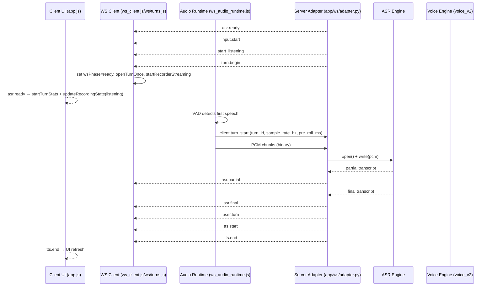

# AskChip “Turn” Lifecycle — As‑Built (2025‑12‑27)

This document describes how conversational turns work **today** (client + server + ASR lifecycle) based strictly on code in this repo. Every behavioral claim is backed by a code excerpt with file paths and function names.

---

## Scope & sources

Client files reviewed (per task):
- `app/static/js/app.js`
- `app/static/js/ws_client.js`
- `app/static/js/audio/capture_runtime.js`
- `app/static/js/audio/pcm_sender.js`
- `app/static/js/audio/ws_audio_runtime.js`
- `app/static/js/audio/vad_client.js`
- `app/static/js/ws/turns.js`

Server files reviewed (per task):
- `app/asgi_gateway.py`
- `app/ws/adapter.py`
- `app/ws/state.py`
- `app/voice_v2/engine.py`
- `app/voice_v2/vad.py`

---

## What is a “turn” in this system today?

### Client definition (UI + capture semantics)

On the client, a “turn” is represented by **turn activity** (`turn.begin`/`turn.end` frames) and the `AppState.turnActive` flag. `app.js` states that `turnActive` is driven by those frames, and it listens for the events to update `AppState.turnActive` and finalize turn stats.

**Source: `app/static/js/app.js` — initialization + turn event listeners**
```js
// - AppState.turnActive is driven by ws/turns.js from "turn.begin"/"turn.end".
// - ws_audio_runtime treats a *missing* turnActive as "true" so audio can flow.
if (typeof window.AppState.phase !== "string") {
  window.AppState.phase = "greet";
}
```
```js
function updateTurnActive(active) {
  const next = Boolean(active);
  if (typeof AppState?.setState === 'function') {
    AppState.setState({ turnActive: next });
  } else if (AppState) {
    AppState.turnActive = next;
  }
  try { AppState?.emit?.('turnActive', { active: next }); } catch {}
}

window.addEventListener('turn.begin', () => {
  updateTurnActive(true);
});

window.addEventListener('turn.end', (event) => {
  updateTurnActive(false);
  const detail = event && event.detail;
  const reason = typeof detail?.reason === 'string' ? detail.reason : null;
  try {
    finishTurnStats('final', { ws_state: getWsStateSnapshot(), reason });
  } catch {}
});
```
**Behavioral notes**
- `AppState.turnActive` is explicitly set by `turn.begin`/`turn.end` events; this is the client’s authoritative “turn active” signal for UI and stats. (See excerpt above.)
- The initial `AppState.phase` defaults to `"greet"` in `app.js` (see excerpt above).

### Server definition (turn_index + ASR turn tracking)

On the server, a user turn is created by `_start_user_turn` (which sets `current_turn_open = True` and assigns a `turn_req_id`) and `_next_turn_index` (which increments the `turn_index`). A special “greet” turn is explicitly set to index `0` by `_ensure_greet_turn`.

**Source: `app/ws/adapter.py` — `_start_user_turn`, `_next_turn_index`, `_ensure_greet_turn`**
```py
def _start_user_turn(self, ctx: AdapterContext) -> None:
    new_req_id = self._make_req_id(ctx)
    ctx.turn_req_id = new_req_id
    ctx.active_req_id = new_req_id
    ctx.current_turn_id = ctx.current_turn_id or new_req_id
    ctx.current_turn_open = True
    ctx.audio_meta = None
    ctx.audio_meta_req_id = None
    ctx.last_partial_for_turn = None
    ctx._logged_missing_audio_meta = False
    ctx.turn_summary_logged = False
    ctx.last_turn_summary_index = None
    ctx._logged_partial_req_id_mismatch = False
    ctx._logged_final_req_id_mismatch = False
    ctx._logged_header_req_id_mismatch = False
    ctx._logged_asr_timeout = False
    ctx.asr_partial_req_id_mismatch_count = 0
    ctx.asr_final_req_id_mismatch_count = 0
    ctx.first_audio_received_ms = None
    ctx.turn_audio_bytes = 0
    ctx.turn_audio_chunks = 0
    ctx.awaiting_client_mic_ready = False
    ctx.client_mic_ready_ms = None
    ctx.no_audio_timeout_started_ms = None
    ctx.no_audio_timeout_deadline_ms = None
    ctx.mic_never_ready_warned = False
    self._cancel_no_audio_safety_net(ctx)
    ctx.last_user_turn_event_key = None
    ctx.last_user_turn_dedup_key = None
    ctx.auto_ready_probe_promotion_logged = False
```
```py
def _next_turn_index(self, ctx: AdapterContext) -> int:
    current_turn = getattr(ctx, "turn_index", None)
    if current_turn is None:
        current_turn = 0
    session_turn = getattr(ctx.session, "turn_index", None)
    if session_turn is None:
        session_turn = current_turn
    next_turn = max(current_turn, session_turn) + 1
    ctx.turn_index = next_turn
    try:
        ctx.session.turn_index = next_turn
    except Exception:
        pass
    return next_turn
```
```py
def _ensure_greet_turn(self, ctx: AdapterContext) -> None:
    """Ensure greet metrics/turn_index are initialized before first TTS."""

    ctx.turn_index = 0
    try:
        ctx.session.turn_index = max(0, int(getattr(ctx.session, "turn_index", 0) or 0))
    except Exception:
        ctx.session.turn_index = 0

    metrics = getattr(ctx, "metrics", {}) or {}
    metrics.setdefault("turn_index", 0)
    metrics.setdefault("turn_started_at", time.monotonic())
```
**Behavioral notes**
- Server turn identity is controlled by `_start_user_turn` (sets `current_turn_open` and request IDs) and `_next_turn_index` (increments `turn_index`).
- `client.turn_stop` is advisory; the server finalizes a turn on ASR final, but also enforces a bounded post-stop safety net to avoid zombie turns if no final arrives.

### Observability: TurnStateMachine (no behavior change)

The server now mirrors turn lifecycle events through a lightweight `TurnStateMachine` (see `app/ws/turn_state_machine.py`). This is an **observability-only** layer: it does **not** change when turns start/stop or when ASR is opened/closed. Instead, it tracks the same lifecycle milestones already logged via `TurnLifecycleRecorder` and emits a per-turn state timeline in the `turn_lifecycle_summary` log line.

Notes:
- The canonical UI bubble source remains the `user.turn` event (see `askchip_voice_turns_debug.md`). The state machine is for logging/invariant visibility only.
- Illegal transitions (e.g., ASR final after stop) are counted and summarized in the `turn_lifecycle_summary` rather than spamming warnings. They do not throw or alter runtime behavior.
- The `turn_lifecycle_summary` timeline is compressed when it grows large (first 3 entries + suppressed marker + last 3 entries).
- A greet “turn 0” is explicitly initialized via `_ensure_greet_turn`. (See excerpts above.)

---

## A) Client-side lifecycle (browser)

### A1) Session start / greet / ConversationReady transitions

The client initializes `AppState.phase = "greet"` (see above) and then uses `voicePhaseController` plus frame inspection to detect greet start/end. On greet start, it pauses audio sending, disables the base gate, and stops the mic. On greet end, it ensures the audio graph is ready, unmutes the mic track, and schedules conversation start / post-greet cleanup.

**Source: `app/static/js/ws_client.js` — greet start/end detection and actions**
```js
function frameSignalsGreetStart(frame) {
  if (!frame || typeof frame !== "object") return false;
  if (frame.type === "greet" || frame.type === "greet.start" || frame.type === "greet.begin") {
    return true;
  }
  if (frame.type === "tts.start" && frame?.meta?.is_greet === true) {
    return true;
  }
  return false;
}

function frameSignalsGreetEnd(frame) {
  if (!frame || typeof frame !== "object") return false;

  // Trust explicit server signals
  if (frame.type === "greet.end" || frame.type === "greet.complete") {
    return true;
  }

  if (frame.type === "tts.end") {
    // Accept tts.end if we are currently in the Greet phase
    if (getPhase() === PHASE.Greet) {
      try {
        logStage("client.greet_end_detected_tts", {
          phase: getPhase(),
          type: frame.type,
          utt_id: frame?.utt_id || null,
        });
      } catch (_) {}
      return true;
    }

    // Fallback to explicit metadata if provided
    if (frame?.meta?.is_greet === true) {
      return true;
    }
  }

  return false;
}
```
```js
function markGreetStart(frame) {
  if (getPhase() === PHASE.Greet) {
    return;
  }
  clearConversationStartTimer();
  clearPostGreetCleanupRetry("greet_start");
  clearPostGreetSpeechWatchdog();
  resetMicAndPcmReady("greet_start");
  resetConversationAsrReady("greet_start");
  wsDiag("greet_start", { utt_id: frame?.utt_id });
  conversationStartPlanned = false;
  conversationStartCommitted = false;
  conversationBlockedLogged = false;
  conversationDelayedLogged = false;
  lastConversationAttemptLog = 0;
  firstPostGreetMicStarted = false;
  hasOpenedAsrForConversation = false;
  postGreetCleanupCompleted = false;
  postGreetCleanupSource = null;
  firstTurnBootstrapArmed = false;
  firstTurnBootstrapSent = false;
  clearBootstrapTurnStartRetry();
  bootstrapTurnId = null;
  try {
    const audioCtx = getPlaybackAudioContext();
    if (audioCtx) {
      const node = audioCtx.createBufferSource();
      node.buffer = audioCtx.createBuffer(1, 1, audioCtx.sampleRate);
      const silentGain = typeof audioCtx.createGain === "function" ? audioCtx.createGain() : null;
      const silentDestination =
        typeof audioCtx.createMediaStreamDestination === "function"
          ? audioCtx.createMediaStreamDestination()
          : null;
      if (silentGain) {
        silentGain.gain.value = 0;
        if (silentDestination) {
          silentGain.connect(silentDestination);
        }
        node.connect(silentGain);
      }
      node.start(0);
      logStage("client.audio_context.pre_warm_for_greet", {});
    }
    if (window.AC_PREPARED !== true) {
      window.AC_PREPARED = true;
      if (audioCtx?.state === "suspended" && typeof audioCtx.resume === "function") {
        audioCtx.resume().catch(() => {});
      }
      logStage("client.audio_context.prepared_before_greet", { state: audioCtx?.state });
    }
  } catch (_) {}
  if (typeof frame?.utt_id === "string" && frame.utt_id) {
    greetUtteranceId = frame.utt_id;
  }
  voicePhaseController.markGreetStart(frame?.utt_id);
  syncAppStatePhase({ force: true });
  try {
    logStage("client.phase.greet_start", { phase: getPhase() });
  } catch (_) {}
  try {
    logStage("client.greet_start", {
      phase: getPhase(),
      wsPhase: AppState?.wsPhase || null,
      utt_id: greetUtteranceId,
    });
  } catch (_) {}
  try {
    setBaseEnabled?.(false, "greet_start");
    logStage("client.greet_start.set_base_enabled", {
      phase: getPhase(),
      wsPhase: AppState?.wsPhase || null,
    });
    setSenderPauseReason("greet", true);
    applySenderPausedState();
    updatePcmSenderState("greet_start");
  } catch (_) {}
  try {
    applyBargeInEnabled(resolvePostGreetBargeInEnabled(), "greet_start");
  } catch (_) {}
  try {
    if (typeof WSClient?.stopRecorderStreaming === "function") {
      WSClient.stopRecorderStreaming("greet_start");
    } else {
      autoStopRecorder("greet_start", { force: true, allowVadStop: true });
    }
    try {
      logStage("client.greet.mic_stop", { phase: getPhase() });
    } catch (_) {}
  } catch (_) {}
}
```
```js
function markGreetEnd(frame) {
  if (getPhase() !== PHASE.Greet) {
    return;
  }
  voicePhaseController.markGreetEnd(frame?.utt_id);
  syncAppStatePhase({ force: true });
  if (!micDebugGreetEndLogged) {
    micDebugGreetEndLogged = true;
    try {
      logStage("mic_debug.greet_end", {
        ts: typeof performance?.now === "function" ? performance.now() : Date.now(),
        phase: getPhase(),
      });
    } catch (_) {}
  }
  try {
    logStage("client.phase.greet_end", { phase: getPhase() });
  } catch (_) {}
  Promise.resolve().then(async () => {
    try { await ensureMicHardware(); } catch (_) {}
    const graphReady = await ensureAudioGraph("greet_to_conversation_ready");
    if (graphReady) {
      markMicAndPcmReady("audio_graph_live");
    }
    try {
      const track = typeof getMicTrack === "function" ? getMicTrack() : null;
      if (track) {
        track.enabled = true;
        logStage("client.mic.hardware_unmute", { phase: getPhase() });
      }
    } catch (_) {}
  });
  try {
    conversationStartPlanned = true;
    scheduleConversationStartAfterGreet("mark_greet_end");
  } catch (_) {}
  requestPostGreetCleanup("mark_greet_end");
}
```
**Behavioral notes**
- Greet start is detected from explicit greet frames or greet-marked `tts.start`, and it disables base audio send + pauses sender + stops the mic. (See excerpts above.)
- Greet end is detected from explicit greet frames or `tts.end` while in the `Greet` phase, and it prepares mic hardware/audio graph for conversation start. (See excerpts above.)

Post-greet cleanup re-enables the sender base gate and unpauses capture; this is explicitly gated by phase and WS readiness.

**Source: `app/static/js/ws_client.js` — `runPostGreetCleanupOnce`**
```js
function runPostGreetCleanupOnce(cleanupSource = "greet_end") {
  if (postGreetCleanupCompleted) {
    return false;
  }
  if (getPhase() === PHASE.Greet) {
    voicePhaseController.markGreetEnd();
    syncAppStatePhase({ force: true });
  }
  const phase = getPhase();
  if (phase !== PHASE.ConversationReady && phase !== PHASE.UserTurn) {
    return false;
  }
  if (!WS_READY_PHASES.has(AppState?.wsPhase)) {
    return false;
  }
  if (!captureRuntime && typeof startRecorderStreaming !== "function") {
    return false;
  }

  const prevGateSnapshot = typeof getPcmSenderGateSnapshot === "function"
    ? getPcmSenderGateSnapshot()
    : null;
  const prevSenderPaused = Boolean(AppState?.senderPaused ?? senderPaused);
  const prevBaseEnabled = getGateSnapshotBaseEnabled(prevGateSnapshot);
  const prevShouldSend = getGateSnapshotShouldSend(prevGateSnapshot);

  try {
    setSenderPauseReason("greet", false);
    applySenderPausedState();
    updatePcmSenderState("post_greet_unpause");
  } catch (_) {}

  try {
    setBaseEnabled?.(true, "post_greet");
  } catch (_) {}

  const nextGateSnapshot = typeof getPcmSenderGateSnapshot === "function"
    ? getPcmSenderGateSnapshot()
    : null;
  const nextSenderPaused = Boolean(AppState?.senderPaused ?? senderPaused);
  const nextBaseEnabled = getGateSnapshotBaseEnabled(nextGateSnapshot);
  const nextShouldSend = getGateSnapshotShouldSend(nextGateSnapshot);

  const bargeInEnabled = resolvePostGreetBargeInEnabled();
  applyBargeInEnabled(bargeInEnabled, "post_greet_cleanup");

  postGreetCleanupCompleted = true;
  postGreetCleanupSource = cleanupSource || postGreetCleanupSource;
  try {
    logStage("client.post_greet.unpause", {
      source: postGreetCleanupSource,
      phase,
      wsPhase: AppState?.wsPhase || null,
      prev: {
        senderPaused: prevSenderPaused,
        base_enabled: prevBaseEnabled,
        shouldSend: prevShouldSend,
      },
      next: {
        senderPaused: nextSenderPaused,
        base_enabled: nextBaseEnabled,
        shouldSend: nextShouldSend,
      },
      barge_in_enabled: bargeInEnabled,
    });
  } catch (_) {}

  if (postGreetCleanupRetryLogged) {
    try {
      logStage("client.post_greet.unpause.retry_succeeded", {
        attempts: postGreetCleanupRetryAttempts,
        phase: getPhase(),
        wsPhase: AppState?.wsPhase || null,
      });
    } catch (_) {}
  }
  clearPostGreetCleanupRetry();
  startPostGreetSpeechWatchdog();
}
```
**Behavioral notes**
- Cleanup only happens once, only after the client is in `ConversationReady`/`UserTurn` **and** WS is ready; it explicitly unpauses the sender and enables base gate. (See excerpt above.)

---

### A2) Turn start (client control paths)

#### A2.1 Bootstrap turn start (non‑Deepgram V3)

For non‑V3 turn control, the client may send a bootstrap `client.turn_start` after greet when the first user speech is detected. It is gated by WS readiness, phase, and a `firstTurnBootstrapArmed` flag.

**Source: `app/static/js/ws_client.js` — `maybeSendBootstrapTurnStart`**
```js
function maybeSendBootstrapTurnStart(source = "post_greet_bootstrap") {
  // Phase 0 invariant: greet never opens ASR; first user speech always starts a turn.
  if (firstTurnBootstrapSent || !firstTurnBootstrapArmed) {
    return false;
  }
  if (isDeepgramV3TurnControlEnabled()) {
    return false;
  }
  if (!canSendBootstrapTurnStart()) {
    return false;
  }
  const turnId = resolveBootstrapTurnId();
  const sampleRateHz =
    Number(AppState?.policy?.sample_rate_hz) ||
    Number(AppState?.policy?.audio?.sample_rate_hz) ||
    Number(AppState?.policy?.audio?.sample_rate) ||
    Number(AppState?.targetSampleRate) ||
    16000;
  const payload = {
    type: "client.turn_start",
    lane: "mic",
    turn_id: turnId || undefined,
    source,
    pre_roll_ms: 0,
    sample_rate_hz: sampleRateHz,
    phase: getPhase(),
    wsPhase: AppState?.wsPhase || null,
  };
  try {
    sendJson(payload);
  } catch (_) {}
  firstTurnBootstrapSent = true;
  firstTurnBootstrapArmed = false;
  clearBootstrapTurnStartRetry();
  postGreetTurnStartSent = true;
  const willRequestAsrOpen = !AppState?.asrReady && !AppState?.asrArmInFlight;
  try {
    logStage("client.turn.bootstrap.turn_start_sent", {
      source,
      turn_id: turnId || null,
      phase: getPhase(),
      wsPhase: AppState?.wsPhase || null,
      asrReady: Boolean(AppState?.asrReady),
      asrArmInFlight: Boolean(AppState?.asrArmInFlight),
      willRequestAsrOpen,
    });
  } catch (_) {}
  if (!firstTurnInvariantOkLogged) {
    firstTurnInvariantOkLogged = true;
    try {
      logStage("client.invariant_ok.first_turn_started", {
        turn_id: turnId || null,
        phase: getPhase(),
        wsPhase: AppState?.wsPhase || null,
      });
    } catch (_) {}
  }
  if (willRequestAsrOpen) {
    safeRequestAsrOpen("turn_bootstrap");
  }
  return true;
}
```
**Behavioral notes**
- Bootstrap `client.turn_start` is only sent if V3 turn control is **not** enabled, and only after WS is ready. (See excerpt above.)
- The payload includes `turn_id`, `pre_roll_ms`, and `sample_rate_hz`, which are mirrored in the V3 path as well. (See excerpt above.)

#### A2.2 Deepgram V3 turn control (speech‑triggered start + preroll)

When Deepgram V3 turn control is enabled, the client defers turn start until **speech is detected** in PCM frames. On the first speech frame, it allocates a `turn_id`, sends `client.turn_start`, and transmits a pre‑speech “preroll” slice from the PCM ring buffer.

**Source: `app/static/js/audio/ws_audio_runtime.js` — V3 turn start**
```js
function sendTurnStart({ turnId, sampleRateHz, preRollMs, vadState } = {}) {
  if (!isTurnControlEnabled()) {
    return false;
  }
  if (turnStartSent) {
    return false;
  }
  const lane = "mic";
  const payload = {
    type: "client.turn_start",
    lane,
    turn_id: turnId,
    pre_roll_ms: preRollMs,
    sample_rate_hz: sampleRateHz,
    ts_ms: Date.now(),
  };
  const vadMeta = buildVadMeta(vadState);
  if (vadMeta) {
    payload.vad = vadMeta;
  }
  try {
    safeSendJSON(payload);
    turnStartSent = true;
    logStage("client.deepgram_v3.turn_start_sent", {
      turn_id: turnId,
      pre_roll_ms: preRollMs,
      sample_rate_hz: sampleRateHz,
      phase: getAppStateSnapshot()?.phase || null,
      wsPhase: getAppStateSnapshot()?.wsPhase || null,
    });
    if (!turnStartSampleRateLogged) {
      turnStartSampleRateLogged = true;
      logStage("client.deepgram_v3.turn_start_sample_rate", {
        turn_id: turnId,
        sample_rate_hz: sampleRateHz,
        pcmHardwareSampleRate,
        pcmSampleRate,
        asrRate,
      });
    }
    return true;
  } catch (_) {
    return false;
  }
}
```
```js
if (turnControlEnabled && !isKeepalive && !speechSeenThisTurn && softDecision.vadLikelySpeech) {
  const turnIdCandidate = typeof getCurrentTurnReqId === "function" ? getCurrentTurnReqId() : null;
  currentTurnId = turnIdCandidate && `${turnIdCandidate}`.length ? `${turnIdCandidate}` : allocateTurnId();
  markSpeechSeen({
    rmsAtTrigger: softDecision.rmsAtTrigger,
    framesSinceGreet: null,
    reqId: currentReqId,
    turnId: currentTurnId,
  });
  sendTurnStart({
    turnId: currentTurnId,
    sampleRateHz: effectiveSampleRate,
    preRollMs: preSpeechBufferMs,
    vadState,
  });
  if (!prerollSent) {
    try {
      const ring = ringBufferManager.getRing?.();
      prerollChunksToSend = ring?.tailMillis?.(preSpeechBufferMs) || [];
    } catch (_) {
      prerollChunksToSend = [];
    }
    if (prerollChunksToSend && prerollChunksToSend.length) {
      sendPrerollChunks(prerollChunksToSend, effectiveSampleRate, {
        turnId: currentTurnId,
        seq: pcmLastSeq,
      });
    }
    prerollSent = true;
  }
}
```

**Behavioral notes**
- V3 turn start is **speech‑gated**: `client.turn_start` is sent only on the first speech frame, and it includes `pre_roll_ms`, `sample_rate_hz`, and optional VAD metadata. (See excerpts above.)
- A pre‑speech buffer is transmitted immediately after the turn start to capture audio that arrived before the `client.turn_start` frame. (See excerpts above.)

---

### A3) Turn end (client control paths)

#### A3.1 VAD silence stop → input.stop / client.turn_stop

Client VAD silence only ends a turn **after** speech has been observed; pre‑speech silence is ignored. When a VAD stop occurs, the client sends `input.stop` (non‑V3) or `client.turn_stop` (V3), and it pauses the sender.

**Source: `app/static/js/ws_client.js` — VAD silence stop + turn stop**
```js
async function handleVadSilenceStop(reason = "vad_silence") {
  const normalized = fallbackToReasonKey(reason) || "vad_silence";

  if (getPhase() === PHASE.Greet) {
    try { logStage("client.mic.auto_stop_suppressed", { phase: PHASE.Greet, reason: normalized }); } catch {}
    return;
  }

  // Only end the turn if we’ve actually heard speech this turn.
  if (!speechSeenThisTurn) {
    // Pre-speech idle silence: do NOT stop the recorder or send input.stop.
    try { AppState?.hub?.log?.('client.vad.idle_silence_ignored', { reason: normalized }); } catch {}
    return;
  }

  // Post-speech EOT silence: now we can end the turn.
  maybeSendTurnStop(normalized);
  try {
    setSenderPauseReason("turn_completed", true);
    applySenderPausedState();
    updatePcmSenderState();
    logStage("client.pcm.soft_pause", { reason: normalized });
  } catch (err) {
    try { console.warn("vad_silence_soft_pause_failed", err); } catch {}
  }
}
```
```js
function maybeSendTurnStop(reason = "vad_silence") {
  if (turnStopSent) {
    return false;
  }
  const key = fallbackToReasonKey(reason) || "vad_silence";
  if (isDeepgramV3TurnControlEnabled()) {
    const ws = WSClient?._ws || window.ws;
    const wsOpen = ws && typeof WebSocket !== "undefined" && ws.readyState === WebSocket.OPEN;
    if (!wsOpen) {
      turnStopSent = true;
      if (typeof audioRuntime?.resetTurnForNextUser === "function") {
        audioRuntime.resetTurnForNextUser();
      }
      return true;
    }
    const sent = typeof audioRuntime?.finalizeTurn === "function"
      ? audioRuntime.finalizeTurn(key)
      : false;
    if (sent) {
      turnStopSent = true;
    }
    return sent;
  }
  sendTurnStop(key);
  turnStopSent = true;
  return true;
}
```

**Source: `app/static/js/ws_client.js` — non‑V3 `input.stop`**
```js
function sendTurnStop(reason = "vad_silence") {
  const ws = WSClient?._ws || window.ws;
  if (!ws || ws.readyState !== WebSocket.OPEN) return;

  const frame = {
    type: "input.stop",
    reason,
    ts: Date.now(),
  };

  try {
    ws.send(JSON.stringify(frame));
    console.log("client.turn_stop", frame);
  } catch (err) {
    console.warn("client.turn_stop_failed", { err, frame });
  }
}
```

**Behavioral notes**
- VAD‑driven silence only stops a turn after speech is observed; pre‑speech silence does not close turns or send `input.stop`. (See excerpt above.)
- `maybeSendTurnStop` sends `client.turn_stop` (V3) or `input.stop` (non‑V3) and uses a `turnStopSent` guard to ensure only one stop per turn. (See excerpt above.)

---

### A4) Audio send gating (PCM allowed to be sent?)

The client computes **hard gates** and **soft gates** for PCM sending in `ws_audio_runtime.js`:
- **Hard gate**: depends on WebSocket readiness and fatal errors (`gumFailed`).
- **Base gate**: `baseEnabled` + `hasStream`.
- **Capture gate**: sender paused state, `canCaptureNow`, mic permission, ws phase readiness.
- **Soft gate**: telemetry‑only VAD speech detection; when V3 turn control is enabled, PCM is dropped until speech has been observed and `client.turn_start` is sent.

**Source: `app/static/js/audio/ws_audio_runtime.js` — hard gate + base gate**
```js
function computeHardGateSnapshot({ wsPhase, fatalError, wsReadyState }) {
  const socketOpen = typeof wsReadyState === "number"
    ? wsReadyState === WebSocket.OPEN
    : true;

  const phaseReady = typeof wsPhase === "string" ? WS_READY_PHASES.has(wsPhase) : true;

  const wsReady = socketOpen && phaseReady;
  let allowed = wsReady && !fatalError;
  let reason = "ok";
  if (!wsReady) {
    allowed = false;
    reason = "ws_not_ready";
  } else if (fatalError) {
    allowed = false;
    reason = "fatal_error";
  }
  return { allowed, reason, wsPhase, wsReadyState };
}
```
```js
function computePcmGateSnapshot() {
  const AppState = getAppState();
  const stateSnapshot = typeof AppState?.getState === "function" ? AppState.getState() : AppState;
  const asrReady = Boolean(stateSnapshot?.asrReady);
  const micPerm = stateSnapshot && typeof stateSnapshot.micPermissionGranted === "boolean"
    ? stateSnapshot.micPermissionGranted
    : true;
  const fatalError = Boolean(gumFailed);
  const wsPhase = typeof stateSnapshot?.wsPhase === "string" ? stateSnapshot.wsPhase : null;
  const wsPhaseKnown = typeof wsPhase === "string" && wsPhase.length > 0;
  const wsReadyForAudio = wsPhaseKnown ? WS_READY_PHASES.has(wsPhase) : true;
  const audioStreaming = Boolean(isAudioStreaming());
  const senderPaused = Boolean(isSenderPaused());
  const captureAllowed = Boolean(canCaptureNow());
  const stream = captureStreamResolved || pcmSender?.mediaStream || null;
  const hasStream = Boolean(
    stream ||
    (pcmSender && typeof pcmSender.getStateSnapshot === "function" && pcmSender.getStateSnapshot()?.mediaStreamActive)
  );
  const baseGate = baseEnabled && hasStream;
  const gates = {
    asrReady,
    micPerm,
    senderPaused,
    canCapture: captureAllowed,
  };
  const shouldSendBase = Boolean(
    baseGate &&
    !gates.senderPaused &&
    gates.canCapture &&
    gates.micPerm &&
    wsReadyForAudio &&
    !fatalError
  );
  const shouldSend = FORCE_PCM_SEND
    ? (baseGate && gates.micPerm && !fatalError)
    : shouldSendBase;
  let decisionReason = "ok";
  if (!baseEnabled) {
    decisionReason = "base_disabled";
  } else if (!hasStream) {
    decisionReason = "no_stream";
  } else if (gates.senderPaused) {
    decisionReason = "sender_paused";
  } else if (!gates.canCapture) {
    decisionReason = "cannot_capture";
  } else if (!gates.micPerm) {
    decisionReason = "mic_perm";
  } else if (!wsReadyForAudio) {
    decisionReason = "ws_not_ready";
  } else if (fatalError) {
    decisionReason = "fatal_error";
  } else if (FORCE_PCM_SEND && !shouldSendBase) {
    decisionReason = "forced";
  }

  return {
    sid: stateSnapshot?.sid || stateSnapshot?.sessionId || null,
    phaseValue,
    wsPhase,
    wsPhaseKnown,
    wsReadyForAudio,
    audioStreaming,
    senderPaused,
    captureAllowed,
    hasStream,
    baseGate,
    shouldSendBase,
    shouldSend,
    asrReady,
    micPerm,
    fatalError,
    decisionReason,
    trackState: stream?.getAudioTracks?.()[0]?.readyState || "unknown",
    ctxState: audioCtx?.state || "unknown",
    isAudioStreaming: audioStreaming,
  };
}
```

**Source: `app/static/js/audio/ws_audio_runtime.js` — PCM drop when no V3 turn**
```js
if (turnControlEnabled) {
  const allowTurnFrames = speechSeenThisTurn && !turnStopSent;
  if (!allowTurnFrames) {
    recordPcmFrameOutcome({
      attempted: chunkCount,
      dropped: chunkCount,
      dropReason: speechSeenThisTurn ? "soft_gate:turn_stopped" : "soft_gate:no_turn",
    });
    if (!isKeepalive) {
      emitPolicyHook("soft_gate_drop", {
        reason: speechSeenThisTurn ? "turn_stopped" : "no_turn",
        wsPhase,
        appPhase: phaseValue,
        wsReadyState,
      });
    }
    return;
  }
}
```

**Behavioral notes**
- PCM is **hard‑gated** on WS readiness + `gumFailed` (fatal error). (See `computeHardGateSnapshot`.)
- PCM is **base‑gated** by `baseEnabled` + `hasStream` and **capture‑gated** by `senderPaused`, `canCaptureNow`, mic permission, and WS phase readiness. (See `computePcmGateSnapshot`.)
- Under V3 turn control, PCM is dropped until a `client.turn_start` has been sent (`speechSeenThisTurn` is true). (See excerpt above.)

---

### A5) Barge‑in handling (client + server interface)

The client treats barge‑in as policy‑controlled and gated by `ttsActive`. It applies policy after greet cleanup and logs when a desired setting conflicts with policy. On the server, VAD aggregation can trigger an auto‑barge attempt (including full‑duplex enablement after greet).

**Source: `app/static/js/ws_client.js` — barge‑in policy + gating**
```js
function isActiveBargeIn() {
  try {
    const bargeInEnabled = AppState?.barge_in_enabled !== false;
    const ttsActive = Boolean(AppState?.ttsActive);
    return Boolean(bargeInEnabled && ttsActive);
  } catch (_) {
    return false;
  }
}

function applyBargeInEnabled(value, source) {
  const normalized = Boolean(value);
  const policySetting = AppState?.policy?.barge_in_enabled;
  if (typeof policySetting === "boolean" && normalized !== policySetting) {
    try {
      logStage("client.barge_in.policy_override", {
        source: source || null,
        desired: normalized,
        policy: policySetting,
        phase: getPhase(),
        wsPhase: AppState?.wsPhase || null,
      });
    } catch (_) {}
  }
  try {
    setAppStateValue?.("barge_in_enabled", normalized);
    if (AppState && typeof AppState === "object") {
      AppState.barge_in_enabled = normalized;
    }
  } catch (_) {}
}
```

**Source: `app/voice_v2/engine.py` — VAD aggregation + auto‑barge hooks**
```py
def _install_vad_aggregator(self, sid: str) -> None:
    if sid in self._aggregators:
        return

    def _policy_supplier() -> Dict[str, Any]:
        snapshot = self.policy_snapshot or {}
        return dict(snapshot)

    aggregator = VADAggregator(self._bus, sid, _policy_supplier)
    aggregator.set_grant_handler(
        lambda source, info, *, _sid=sid: self._handle_vad_grant(_sid, source, info)
    )
    self._aggregators[sid] = aggregator


def enable_full_duplex(self, sid: str) -> None:
    """Allow VAD to run during TTS playback after greet completion."""

    aggregator = self._aggregators.get(sid)
    if aggregator is not None:
        aggregator.enable_full_duplex()


def _handle_vad_grant(self, sid: str, source: str, info: Dict[str, Any]) -> None:
    reason = "vad_grant"
    mode = info.get("mode") if isinstance(info, Mapping) else None
    if mode == "and":
        reason = "vad_grant_dual"
    self.on_auto_barge_attempt(sid, source, reason=reason)
```

**Behavioral notes**
- Client barge‑in is gated by `barge_in_enabled` and `ttsActive`, and policy overrides are logged. (See excerpt above.)
- Server VAD aggregation can trigger `on_auto_barge_attempt`, and it supports full‑duplex gating after greet. (See excerpt above.)

---

### A6) Telemetry and debug logging (golden‑path markers)

The client tracks per‑turn stats (`TurnStats`) and sends a `client.turn.summary` log on completion. It also marks `asr.ready` as the start of turn tracking and forces the UI into listening mode.

**Source: `app/static/js/app.js` — `TurnStats`, start/finish, and `asr.ready` handler**
```js
const TurnStats = {
  active: null,
};

function startTurnStats(sid) {
  TurnStats.active = {
    sid,
    startedAt: performance.now(),
    firstChunkAt: null,
    lastChunkAt: null,
    chunkCount: 0,
    lastPartialText: "",
  };
}

function finishTurnStats(outcome, extraMeta = {}) {
  const t = TurnStats.active;
  if (!t) return;
  const now = performance.now();
  const summary = {
    sid: t.sid || AppState?.sid || null,
    outcome, // "final", "timeout", "error", "client_end", etc.
    duration_ms: t.startedAt !== null ? Math.round(now - t.startedAt) : null,
    speech_ms: t.firstChunkAt !== null && t.lastChunkAt !== null
      ? Math.round(t.lastChunkAt - t.firstChunkAt)
      : null,
    chunk_count: t.chunkCount,
    last_partial_text: t.lastPartialText,
    ...extraMeta,
  };

  try {
    console.debug("client_turn_summary", summary);
    if (typeof sendClientLog === "function") {
      sendClientLog("client.turn.summary", summary);
    }
  } catch (err) {
    // best-effort only
  } finally {
    TurnStats.active = null;
  }
}
```
```js
window.addEventListener('asr.ready', (event) => {
  // CRITICAL FIX: REMOVE ASYNCHRONOUS DEFERRAL TO BEAT SERVER TIMEOUT

  try {
    startTurnStats(AppState?.sid);
  } catch {}

  rearmSilenceWatchdogAfterDelay('asr.ready');
  if (typeof AppState?.setState === 'function') {
    AppState.setState({ asrReady: true, turnActive: true });
  } else if (AppState) {
    AppState.asrReady = true;
    AppState.turnActive = true;
  }

  // *** NEW STABLE LOGIC ***
  // Directly force the UI/state to "listening" which triggers WSClient.js to start streaming.
  updateRecordingState(true, 'asr_ready_signal');

  // REMOVED: All silence watchdog and redundant mic capture logic (arm, schedule, etc.)

  try {
    emitConsoleBusEvent('client.ui_badge', { state: 'Listening' });
  } catch {}
  if (diagHudEnabled()) {
    console.info('diag=asr_ready');
    setBadge('asr:ready');
    sendDiagHudEvent(
      'EVT_CLIENT_ASR_READY',
      event && typeof event === 'object' ? event.detail : undefined,
      { level: 'info', badge: 'asr:ready', message: 'diag=asr_ready' }
    );
  }

  // Reset any retry count for ASR
  if (asrRetry && typeof asrRetry === 'object' && asrRetry.tries > 0) {
    try {
      window.ChatView?.showSystemFromChip?.(
        "Voice is back. You can speak again when you’re ready."
      );
    } catch (err) {
      console.warn('Failed to show voice restoration message', err);
    }
    asrRetry.tries = 0;
    clearTimeout(asrRetry.timer);
    asrRetry.timer = null;
  }

  // Final UI refresh is mandatory
  window.AppUI?.refresh?.();
});
```

**Behavioral notes**
- `startTurnStats` is called on `asr.ready`, and `finishTurnStats` is triggered on `turn.end` and error events. (See excerpts above and in the “turn begin/end” section.)

---

## B) Server-side lifecycle (Python)

### B1) /ws/v2/chat endpoint and adapter

The WebSocket endpoint is `/ws/v2/chat` as defined in `app/asgi_gateway.py`, and the chat v2 adapter implements message handling in `app/ws/adapter.py`.

**Source: `app/asgi_gateway.py` — WebSocket route**
```py
WS_ROUTE = "/ws/v2/chat"
```

### B2) JSON control frames: `client.turn_start`, `client.turn_stop`, `input.stop`

The adapter validates and handles `client.turn_start`/`client.turn_stop` (V3 only) and handles `input.stop` for non‑V3 flows, routing it to `_handle_client_turn_stop`.

**Source: `app/ws/adapter.py` — JSON frame handling**
```py
if frame_type == "client.turn_start":
    if not ctx.v3_enabled:
        await self._publish_json_recv(ctx, meta, frame_payload)
        return self._HandleResult(True)

    lane = frame.get("lane")
    if lane is not None and not isinstance(lane, str):
        meta["error"] = "schema_invalid"
        await self._publish_json_recv(ctx, meta, frame_payload)
        await self._send_error(
            send,
            ctx.sid,
            "schema_invalid",
            "client.turn_start lane must be a string if provided",
        )
        return self._HandleResult(True)

    raw_turn_id = frame.get("turn_id")
    if not isinstance(raw_turn_id, str) or not raw_turn_id.strip():
        meta["error"] = "schema_invalid"
        await self._publish_json_recv(ctx, meta, frame_payload)
        await self._send_error(
            send,
            ctx.sid,
            "schema_invalid",
            "client.turn_start turn_id must be a non-empty string",
        )
        return self._HandleResult(True)

    pre_roll_value = frame.get("pre_roll_ms")
    if pre_roll_value is not None and (
        not isinstance(pre_roll_value, (int, float))
        or isinstance(pre_roll_value, bool)
    ):
        meta["error"] = "schema_invalid"
        await self._publish_json_recv(ctx, meta, frame_payload)
        await self._send_error(
            send,
            ctx.sid,
            "schema_invalid",
            "client.turn_start pre_roll_ms must be a number if provided",
        )
        return self._HandleResult(True)

    sample_rate_value = frame.get("sample_rate_hz")
    await self._publish_json_recv(ctx, meta, frame_payload)

    normalized_turn_id = raw_turn_id.strip()
    parsed_rate = None
    if isinstance(sample_rate_value, (int, float)) and not isinstance(
        sample_rate_value, bool
    ):
        if not isinstance(sample_rate_value, float) or sample_rate_value.is_integer():
            parsed_rate = int(sample_rate_value)
    resolved_rate = parsed_rate
    if resolved_rate is None or resolved_rate < 8000 or resolved_rate > 48000:
        fallback_rate = getattr(
            config, "DEEPGRAM_STT_SAMPLE_RATE", _DEFAULT_SAMPLE_RATE_HZ
        )
        try:
            fallback_rate = int(fallback_rate)
        except (TypeError, ValueError):
            fallback_rate = _DEFAULT_SAMPLE_RATE_HZ
        resolved_rate = fallback_rate
        _log.info(
            "evt=deepgram_v3.sample_rate_clamped",
            extra={
                "sid": ctx.sid,
                "turn_id": normalized_turn_id,
                "provided": sample_rate_value,
                "used": resolved_rate,
            },
        )
    if ctx.current_turn_open:
        if ctx.session.asr_state == "open" or ctx.asr_open:
            await self._close_asr(ctx, reason="turn_start_overlap")
        self._log_deepgram_v3_turn_summary(ctx, "turn_overlap")
        _log.warning(
            "evt=deepgram_v3.turn_overlap_recovered",
            extra={
                "sid": ctx.sid,
                "turn_id": ctx.current_turn_id,
                "new_turn_id": normalized_turn_id,
                "bytes_from_client": ctx.bytes_from_client_this_turn,
                "bytes_to_vendor": ctx.asr_bytes_sent,
            },
        )
        self._reset_v3_turn_state(ctx)

    ctx.current_turn_id = normalized_turn_id
    ctx.current_turn_open = True
    ctx.turn_start_ts_ms = self._now_ms()
    ctx.bytes_from_client_this_turn = 0
    ctx.accepting_audio = True
    ctx.audio_ignored_no_turn_logged = False
    ctx.v3_turn_sample_rate_hz = resolved_rate
    ctx.v3_turn_summary_logged = False
    ctx.v3_turn_summary_turn_id = None
    ctx.turn_watchdog_last_log_ms = None
    self._refresh_no_audio_safety_net(ctx)

    _log.info(
        "evt=deepgram_v3.turn_start",
        extra={
            "sid": ctx.sid,
            "turn_id": ctx.current_turn_id,
            "pre_roll_ms": pre_roll_value,
            "sample_rate_hz": resolved_rate,
            "bytes_from_client": ctx.bytes_from_client_this_turn,
            "bytes_to_vendor": ctx.asr_bytes_sent,
        },
    )

    return self._HandleResult(True)
```
```py
if frame_type == "client.turn_stop":
    if not ctx.v3_enabled:
        await self._publish_json_recv(ctx, meta, frame_payload)
        return self._HandleResult(True)

    lane = frame.get("lane")
    if lane is not None and not isinstance(lane, str):
        meta["error"] = "schema_invalid"
        await self._publish_json_recv(ctx, meta, frame_payload)
        await self._send_error(
            send,
            ctx.sid,
            "schema_invalid",
            "client.turn_stop lane must be a string if provided",
        )
        return self._HandleResult(True)

    raw_turn_id = frame.get("turn_id")
    if not isinstance(raw_turn_id, str) or not raw_turn_id.strip():
        meta["error"] = "schema_invalid"
        await self._publish_json_recv(ctx, meta, frame_payload)
        await self._send_error(
            send,
            ctx.sid,
            "schema_invalid",
            "client.turn_stop turn_id must be a non-empty string",
        )
        return self._HandleResult(True)

    reason_value = frame.get("reason")
    if not isinstance(reason_value, str) or not reason_value.strip():
        meta["error"] = "schema_invalid"
        await self._publish_json_recv(ctx, meta, frame_payload)
        await self._send_error(
            send,
            ctx.sid,
            "schema_invalid",
            "client.turn_stop reason must be a non-empty string",
        )
        return self._HandleResult(True)

    await self._publish_json_recv(ctx, meta, frame_payload)

    normalized_turn_id = raw_turn_id.strip()
    if ctx.current_turn_id and ctx.current_turn_id != normalized_turn_id:
        _log.warning(
            "evt=asr_v3.turn_stop_mismatch",
            extra={
                "sid": ctx.sid,
                "expected_turn_id": ctx.current_turn_id,
                "turn_id": normalized_turn_id,
            },
        )

    normalized_reason = reason_value.strip()
    ctx.current_turn_open = False

    _log.info(
        "evt=deepgram_v3.turn_stop",
        extra={
            "sid": ctx.sid,
            "turn_id": ctx.current_turn_id or normalized_turn_id,
            "bytes_from_client": ctx.bytes_from_client_this_turn,
            "bytes_to_vendor": ctx.asr_bytes_sent,
            "reason": normalized_reason,
        },
    )

    if ctx.session.asr_state == "open" or ctx.asr_open:
        await self._flush_audio_buffer(ctx)
        await self._close_asr(
            ctx,
            reason=normalized_reason,
        )
        _log.info(
            "evt=deepgram_v3.asr_close",
            extra={
                "sid": ctx.sid,
                "turn_id": ctx.current_turn_id or normalized_turn_id,
                "bytes_from_client": ctx.bytes_from_client_this_turn,
                "bytes_to_vendor": ctx.asr_bytes_sent,
                "reason": normalized_reason,
            },
        )

    self._log_deepgram_v3_turn_summary(ctx, normalized_reason)
    self._reset_v3_turn_state(ctx)

    return self._HandleResult(True)
```
```py
if frame_type == "input.stop":
    reason_value = frame.get("reason")
    reason = reason_value if isinstance(reason_value, str) and reason_value else "client_turn_stop"
    await self._handle_client_turn_stop(ctx, reason=reason, frame=frame, meta=meta)
    return self._HandleResult(True)
```

**Behavioral notes**
- V3 turn control is explicit: `client.turn_start`/`client.turn_stop` require non‑empty `turn_id`. (See validation excerpts above.)
- Non‑V3 turn stops are expressed as `input.stop` and handled by `_handle_client_turn_stop`. (See excerpt above.)

### B3) Binary audio ingest and buffering

The adapter accepts binary PCM audio frames, buffers them in a bounded sequence window, and flushes into ASR when ready. It follows a “mailbox / always‑buffer” rule for mic PCM and refuses to drop based solely on conversational state. Under V3, however, audio is ignored if no turn is currently open.

**Source: `app/ws/adapter.py` — `_handle_binary` mailbox rule and V3 gating**
```py
# Conversation Core INV-1: Mailbox / Always-Buffer Rule. For the primary
# mic PCM lane we always accept binary audio, update ingress metrics,
# and ingest into the bounded ring buffer. We never reject mic audio here
# based on conversational state; turn/ASR decisions happen after
# buffering.
```
```py
if ctx.v3_enabled and not ctx.current_turn_open:
    if not ctx.audio_ignored_no_turn_logged:
        ctx.audio_ignored_no_turn_logged = True
        _log.info(
            "evt=deepgram_v3.pcm_without_turn",
            extra={
                "sid": ctx.sid,
                "turn_id": ctx.current_turn_id,
                "bytes": byte_count,
                "bytes_from_client": ctx.bytes_from_client_this_turn,
                "bytes_to_vendor": ctx.asr_bytes_sent,
            },
        )
    return self._HandleResult(True)
```

**Source: `app/ws/adapter.py` — `_ingest_audio_chunk` buffer + overflow policy**
```py
ctx.audio_buffer[seq] = chunk_bytes
ctx.audio_buffer_bytes += len(chunk_bytes)
if seq > ctx.audio_highest_seq:
    ctx.audio_highest_seq = seq
capacity = self._mic_buffer_capacity_bytes(ctx)
dropped_bytes = 0
while ctx.audio_buffer_bytes > capacity and ctx.audio_buffer:
    oldest_seq = min(ctx.audio_buffer)
    removed = ctx.audio_buffer.pop(oldest_seq, None)
    if removed is None:
        break
    removed_len = len(removed)
    ctx.audio_buffer_bytes -= removed_len
    dropped_bytes += removed_len

if dropped_bytes:
    if ctx.audio_buffer:
        ctx.audio_expected_seq = max(
            ctx.audio_expected_seq, min(ctx.audio_buffer)
        )
        ctx.audio_highest_seq = max(ctx.audio_buffer)
    else:
        ctx.audio_expected_seq = max(ctx.audio_expected_seq, seq + 1)
        ctx.audio_highest_seq = ctx.audio_expected_seq - 1
    ctx.audio_overflow_events = getattr(ctx, "audio_overflow_events", 0) + 1
    ctx.audio_overflow_total_bytes = (
        getattr(ctx, "audio_overflow_total_bytes", 0) + dropped_bytes
    )
    now_ms = self._now_ms()
    last_ms = getattr(ctx, "audio_overflow_last_log_ms", None) or 0

    should_log = False
    if ctx.audio_overflow_events <= 3:
        should_log = True
    elif (now_ms - last_ms) >= 1000:
        should_log = True

    if should_log:
        ctx.audio_overflow_last_log_ms = now_ms
        _log.info(
            "evt=audio_buffer_overflow sid=%s turn_id=%s capacity_bytes=%s "
            "dropped_bytes=%s remaining_bytes=%s buffer_len=%s "
            "total_events=%s total_dropped_bytes=%s",
            ctx.sid,
            ctx.current_turn_id,
            capacity,
            dropped_bytes,
            ctx.audio_buffer_bytes,
            len(ctx.audio_buffer),
            ctx.audio_overflow_events,
            ctx.audio_overflow_total_bytes,
        )
```

**Behavioral notes**
- PCM is accepted and buffered regardless of conversational state **except** under V3 when no turn is open, where audio is explicitly ignored. (See excerpts above.)
- Overflow is handled by dropping oldest buffered sequences and logging `evt=audio_buffer_overflow`. (See excerpt above.)

### B4) ASR open/close lifecycle

ASR streams are opened in `_open_asr` (creating a new stream ID and opening the vendor engine) and closed in `_close_asr`. The adapter schedules ASR open on the first PCM chunk when a turn is open but no stream exists.

**Source: `app/ws/adapter.py` — schedule open on first PCM**
```py
if ctx.asr_stream_id is None:
    if ctx.current_turn_open and not ctx.asr_open and ctx.asr_open_task is None:
        await self._ensure_previous_turn_closed(ctx, "pcm_first_chunk")
        self._schedule_asr_open(ctx)
        self._log_audio_frame_ingest(
            ctx,
            "pre_open_asr_scheduled",
            byte_count,
        )
        sample_rate = self._resolve_asr_sample_rate(ctx)
        language_config = self._resolve_asr_config(ctx)
        language_code = (
            language_config.get("language")
            if isinstance(language_config, Mapping)
            else None
        ) or getattr(config, "DEEPGRAM_STT_LANGUAGE", "en-US")
        _log.info(
            "evt=deepgram_v3.asr_open",
            extra={
                "sid": ctx.sid,
                "turn_id": ctx.current_turn_id,
                "sample_rate": sample_rate,
                "language": language_code,
                "bytes_from_client": ctx.bytes_from_client_this_turn,
                "bytes_to_vendor": ctx.asr_bytes_sent,
            },
        )
        await self._invoke_engine("on_asr_open", ctx.sid, ctx.current_turn_id)
    else:
        self._log_audio_frame_ingest(
            ctx, "ignored_pre_open_no_stream", byte_count
        )
```

**Source: `app/ws/adapter.py` — `_open_asr` + `_close_asr`**
```py
def _open_asr(self, ctx: AdapterContext) -> None:
    try:
        _log.info(
            "evt=asr_open_begin sid=%s vendor=%s sample_rate=%s language=%s",
            ctx.sid,
            vendor,
            sample_rate,
            language,
        )
        if ctx.v3_enabled:
            _log.debug(
                "evt=deepgram_v3.asr_open",
                extra={
                    "sid": ctx.sid,
                    "turn_id": ctx.current_turn_id,
                    "sample_rate_hz": sample_rate,
                },
            )
        metrics = getattr(ctx, "metrics", {})
        metrics["asr_started_at"] = time.monotonic()
        await engine.open(
            sample_rate=sample_rate,
            language=language,
            sid=ctx.sid,
            on_result=_on_result,
        )
```
```py
def _close_asr(self, ctx: AdapterContext, *, reason: Optional[str] = None) -> None:
    self._cancel_no_audio_safety_net(ctx)
    task = ctx.asr_open_task
    ctx.asr_open_task = None
    if task is not None and not task.done():
        task.cancel()
        with contextlib.suppress(asyncio.CancelledError):
            await task

    engine = ctx.session.asr_engine
    ctx.session.asr_engine = None
    ctx.asr_open = False
    vendor = self._normalize_asr_vendor(
        ctx.asr_vendor or getattr(config, "ASR_VENDOR", None)
    ) or "deepgram"

    if ctx.session.asr_state in {"opening", "open"}:
        mark(ctx.session, "closing")

    if engine is not None:
        try:
            await engine.close()
        except Exception:
            _log.warning(
                "evt=asr_close_failed sid=%s vendor=%s", ctx.sid, vendor, exc_info=True
            )

    await self._close_deepgram_shadow(ctx, reason=reason or "closed")

    mark(ctx.session, "closed")
    ctx.session.first_chunk_sent = False
    ctx.session.queued_arm = False
    ctx.asr_ready = False
    if reason:
        if reason == "transport_closed":
            self._log(ctx, "server.ws_transport_closed", {"hint": "client WS dropped"})
        ctx.asr_close_reason = reason
    ctx.session.eot_armed = False
    ctx.session.server_vad_speech = False
    ctx.session.server_vad_since_ms = None
    ctx.last_asr_partial = None
    ctx.asr_stream_id = None
    ctx.asr_stream_req_id = None
```

**Behavioral notes**
- ASR open is scheduled on first PCM chunk when a turn is open but no stream exists, and `_open_asr` is responsible for stream ID allocation and vendor open. (See excerpts above.)
- `_close_asr` fully resets ASR state and clears readiness flags. (See excerpt above.)

### B5) ASR partial/final events + user.turn emission

ASR results are handled in `_handle_asr_result`. Partial results are published as `EVT_ASR_PARTIAL` and forwarded to the engine (`on_asr_partial`). Final results are published as `EVT_ASR_FINAL` and then routed to user‑turn handling, which emits `user.turn` frames back to the client.

**Source: `app/ws/adapter.py` — `_handle_asr_result` and `_emit_user_turn_event`**
```py
if not is_final:
    ctx.partial_seq += 1
    meta["partial_seq"] = ctx.partial_seq
    event_payload = {
        "type": EVT_ASR_PARTIAL,
        "sid": ctx.sid,
        "text": text,
        "vendor": vendor,
        "meta": dict(meta),
        "req_id": req_for_events,
    }
else:
    if not text.strip():
        meta["no_speech"] = True
    event_payload = {
        "type": EVT_ASR_FINAL,
        "sid": ctx.sid,
        "text": text,
        "vendor": vendor,
        "meta": dict(meta),
        "req_id": req_for_events,
    }

bus.publish(event_payload)
if not is_final:
    await self._invoke_engine("on_asr_partial", ctx.sid, req_id, 1.0, text)
    return
```
```py
_log_llm_turn_decision("llm_turn", "non_empty_user_final")
await self._emit_user_turn_event(ctx, text, turn_index, req_id_final)
await self._invoke_engine("on_asr_final", ctx.sid, text, req_id_final)
if ctx.session.asr_state == "open" or ctx.asr_open:
    await self._close_asr(ctx, reason="normal_final")
    _log.info(
        "evt=asr_v3.asr_close",
        extra={
            "sid": ctx.sid,
            "turn_id": ctx.current_turn_id,
            "bytes_from_client": ctx.bytes_from_client_this_turn,
            "reason": "normal_final",
        },
    )
ctx.current_turn_open = False
ctx.current_turn_id = None
ctx.turn_start_ts_ms = None
ctx.bytes_from_client_this_turn = 0
ctx.audio_ignored_no_turn_logged = False
TurnLifecycleRecorder.finalize_and_log(ctx, outcome="ok")
self._log_turn_summary(ctx, "ok")
self._end_user_turn(ctx)
```
```py
async def _emit_user_turn_event(
    self,
    ctx: AdapterContext,
    text: str,
    turn_index: Optional[int],
    req_id: Optional[str],
) -> None:
    turn_id = ctx.current_turn_id or req_id or ctx.turn_req_id
    text_value = text.strip() if isinstance(text, str) else ""
    if not text_value:
        _log.info(
            "evt=user_turn_event_skip_empty sid=%s turn_id=%s turn_index=%s",
            ctx.sid,
            turn_id,
            turn_index,
        )
        return
    key = f"{turn_id}|{text_value}" if turn_id or text_value else None
    if key and key == ctx.last_user_turn_event_key:
        if key != ctx.last_user_turn_dedup_key:
            ctx.last_user_turn_dedup_key = key
            _log.info(
                "evt=user_turn_event_dedup sid=%s turn_id=%s turn_index=%s",
                ctx.sid,
                turn_id,
                turn_index,
            )
        return

    ctx.last_user_turn_event_key = key
    ctx.last_user_turn_dedup_key = None
    payload = {
        "type": "user.turn",
        "sid": ctx.sid,
        "req_id": req_id,
        "turn_id": turn_id,
        "turn_index": turn_index,
        "text": text,
        "source": "asr",
    }
    _log.info(
        "evt=user_turn_event sid=%s turn_id=%s turn_index=%s", ctx.sid, turn_id, turn_index
    )
    if ctx.ws_send is not None:
        await self._send_json(ctx.ws_send, ctx.sid, payload)
```

**Behavioral notes**
- ASR partials and finals are published to the telemetry bus and then drive `user.turn` emission via `_emit_user_turn_event`. (See excerpts above.)

---

## C) “As‑built contract” (implicit behaviors enforced by code)

### C1) Required ordering and boundary expectations

- **V3 accepts PCM before `client.turn_start`**: the adapter always buffers mic audio; the server opens the turn on the first post‑greet audio frame when it decides the turn is valid. `client.turn_start` is advisory and idempotent. (See `_handle_binary` + `ensure_turn_open` excerpts above.)
- **`client.turn_start` must include a non‑empty `turn_id`**: schema validation enforces this; invalid frames receive errors. (See JSON handling excerpt above.)
- **Non‑V3 input stops are expressed as `input.stop`**: the client sends `input.stop`, and the server handles it via `_handle_client_turn_stop`. (See `sendTurnStop` and `input.stop` handling excerpts above.)

### C2) Authority of identifiers (turn_id vs req_id)

- **Server is authoritative for turn open/close**: `client.turn_start`/`client.turn_stop` are advisory control frames; the server decides when a turn opens (first post‑greet PCM) and closes (ASR final/timeout). Use `turn_lifecycle_summary` (`timeline`, `transition_count`, `illegal_count`, `first_illegal`) to debug ordering issues.
- **V3 turn_id is client‑provided**: `client.turn_start` requires `turn_id`, and the server may use it when the turn opens before any PCM. (See `client.turn_start` handling excerpt above.)
- **Server req_id is generated for user turns**: `_start_user_turn` allocates a new request ID (`turn_req_id`) and sets `current_turn_open`. (See `_start_user_turn` excerpt above.)
- **User turn events echo both `turn_id` and `req_id`**: `_emit_user_turn_event` includes both fields in the outbound frame. (See `_emit_user_turn_event` excerpt above.)

### C3) Client assumptions about `asr.ready`

The client treats `asr.ready` as the signal to open capture + update state. It sets `wsPhase=ready`, opens a turn, starts the recorder, and sends the audio header.

**Source: `app/static/js/ws/turns.js` — `asr.ready` handler**
```js
if (frame.type === "asr.ready") {
  if (typeof frame.sid === "string" && frame.sid) {
    AppState.asrSid = frame.sid;
  }
  const readyFrame = handleAsrReadyFrame(frame) || frame;
  setAsrArmInFlight(false);
  setWsConnected(true);
  setWsPhase("ready");
  emitConsoleBusEvent("client.asr.ready", { asrReady: true });
  const startReason = "asr_ready_forced_start";
  hubLogger("client.ws_ready_check", {
    socketOpen: (() => {
      const socket = getSocket();
      return !!socket && socket.readyState === WebSocket.OPEN;
    })(),
    phase: (AppState?.wsPhase || AppState?.connectionState || null),
  });
  try {
    await openTurnOnce(startReason);
  } catch {}
  try {
    ensureTurnAudioReqId(frame?.policy || AppState?.policy || {});
  } catch {}
  try {
    const started = await startRecorderStreaming(frame?.policy || {}, startReason);
    if (started) {
      audioStreaming = true;
      try { logPcmSenderGateSnapshot("asr.ready"); } catch {}
      try { sendAudioHeader(readyFrame || frame); } catch {}
    }
  } catch (err) {
    console.warn("auto-arm on asr.ready failed", err);
  }
  try {
    const capturePolicy = AppState?.policy?.capture || {};
    const mode = typeof capturePolicy?.mode === "string" && capturePolicy.mode
      ? capturePolicy.mode
      : "webrtc_aec";
    const ctxRate = (() => {
      try { return getMicAudioContext()?.sampleRate || 16000; } catch (_) { return 16000; }
    })();
    emitConsoleBusEvent("client.capture.mode", { mode, ctxSampleRate: ctxRate });
  } catch {}
  logStage("diag", { label: "asr.ready" });
  logStage("client.asr_arm_clear", { vendor: AppState.asrVendor || DEFAULT_ASR_VENDOR });
  if (AppState._recoverPrimePending) {
    const sid = readyFrame?.sid || AppState?.asrSid || `${now()}`;
    primeAsrStreamFromRing(sid);
    AppState._recoverPrimePending = false;
  }
  return;
}
```

**Behavioral notes**
- `asr.ready` is treated as a hard transition to ready/listening: it opens a turn, starts capture, and sends an audio header. (See excerpt above.)

---

## Message / event catalog (frames + ownership)

| Frame / event | Direction | Required fields (enforced) | Producer | Consumer(s) |
| --- | --- | --- | --- | --- |
| `client.turn_start` | Client → Server | `turn_id` non‑empty string; optional `lane`, `pre_roll_ms`, `sample_rate_hz` | `ws_audio_runtime.js` (V3) or `ws_client.js` (bootstrap) | `app/ws/adapter.py` |
| `client.turn_stop` | Client → Server | `turn_id` non‑empty string; `reason` non‑empty string | `ws_audio_runtime.js` via `finalizeTurn` | `app/ws/adapter.py` |
| `input.stop` | Client → Server | `reason` optional | `ws_client.js` | `app/ws/adapter.py` (`_handle_client_turn_stop`) |
| `asr.ready` | Server → Client | (bundle includes `input` + `policy`) | `app/ws/adapter.py` | `app/static/js/ws/turns.js`, `app/static/js/app.js` |
| `input.start` | Server → Client | (capture descriptor) | `app/ws/adapter.py` | `app/static/js/ws/turns.js` |
| `start_listening` | Server → Client | (policy) | `app/ws/adapter.py` | `app/static/js/ws/turns.js` |
| `asr.partial` | Server → Client | `text` | `app/ws/adapter.py` (bus) | `app/static/js/ws_client.js` + `app/static/js/app.js` |
| `asr.final` | Server → Client | `text` | `app/ws/adapter.py` (bus) | `app/static/js/ws_client.js` + `app/static/js/app.js` |
| `user.turn` | Server → Client | `text`, `turn_id`, `turn_index` | `app/ws/adapter.py` | `app/static/js/ws_client.js` |
| `turn.begin` / `turn.end` | Server → Client | none | `app/ws/adapter.py` | `app/static/js/ws/turns.js`, `app/static/js/app.js` |
| `asr.turn` (`begin`/`end`) | Server → Client | `state` | `app/ws/adapter.py` | `app/static/js/ws/turns.js` |
| `tts.start` / `tts.end` | Server → Client | optional `meta.is_greet` | server (TTS pipeline) | `app/static/js/ws_client.js`, `app/static/js/app.js` |

### Catalog evidence (code excerpts)

**`client.turn_start` / `client.turn_stop` (client) & validation (server)**
```js
// ws_audio_runtime.js
const payload = {
  type: "client.turn_start",
  lane,
  turn_id: turnId,
  pre_roll_ms: preRollMs,
  sample_rate_hz: sampleRateHz,
  ts_ms: Date.now(),
};
```
```js
const payload = {
  type: "client.turn_stop",
  lane,
  turn_id: currentTurnId,
  reason,
  ts_ms: Date.now(),
};
```
```py
# adapter.py
if frame_type == "client.turn_start":
    raw_turn_id = frame.get("turn_id")
    if not isinstance(raw_turn_id, str) or not raw_turn_id.strip():
        meta["error"] = "schema_invalid"
        await self._publish_json_recv(ctx, meta, frame_payload)
        await self._send_error(
            send,
            ctx.sid,
            "schema_invalid",
            "client.turn_start turn_id must be a non-empty string",
        )
        return self._HandleResult(True)
if frame_type == "client.turn_stop":
    raw_turn_id = frame.get("turn_id")
    if not isinstance(raw_turn_id, str) or not raw_turn_id.strip():
        meta["error"] = "schema_invalid"
        await self._publish_json_recv(ctx, meta, frame_payload)
        await self._send_error(
            send,
            ctx.sid,
            "schema_invalid",
            "client.turn_stop turn_id must be a non-empty string",
        )
        return self._HandleResult(True)
```

**`input.stop` (client) & `_handle_client_turn_stop` (server)**
```js
// ws_client.js
const frame = {
  type: "input.stop",
  reason,
  ts: Date.now(),
};
ws.send(JSON.stringify(frame));
```
```py
# adapter.py
if frame_type == "input.stop":
    reason_value = frame.get("reason")
    reason = reason_value if isinstance(reason_value, str) and reason_value else "client_turn_stop"
    await self._handle_client_turn_stop(ctx, reason=reason, frame=frame, meta=meta)
    return self._HandleResult(True)
```

**`asr.ready` / `input.start` / `start_listening` (server bundle)**
```py
# adapter.py
asr_ready_frame = {
    "type": "asr.ready",
    "ts_ms": now_ms,
    "vendor": vendor,
    "input": input_payload,
}
input_start = {
    "type": "input.start",
    "capture": capture,
}
start_payload: Dict[str, Any] = {"type": "start_listening"}
await self._send_json(send, ctx.sid, asr_ready_frame)
await self._send_json(send, ctx.sid, input_start)
ctx.pending_start_listening = dict(start_payload)
ctx.pending_start_listening_sent = False
mask_phase = ctx.tts_mask_phase or "off"
if ctx.asr_ready and mask_phase == "off":
    await self._send_json(send, ctx.sid, start_payload)
```

**`asr.partial` / `asr.final` / `user.turn` (server → client)**
```py
# adapter.py (publish)
if not is_final:
    ctx.partial_seq += 1
    meta["partial_seq"] = ctx.partial_seq
    event_payload = {
        "type": EVT_ASR_PARTIAL,
        "sid": ctx.sid,
        "text": text,
        "vendor": vendor,
        "meta": dict(meta),
        "req_id": req_for_events,
    }
else:
    if not text.strip():
        meta["no_speech"] = True
    event_payload = {
        "type": EVT_ASR_FINAL,
        "sid": ctx.sid,
        "text": text,
        "vendor": vendor,
        "meta": dict(meta),
        "req_id": req_for_events,
    }
```
```py
# adapter.py (user.turn)
payload = {
    "type": "user.turn",
    "sid": ctx.sid,
    "req_id": req_id,
    "turn_id": turn_id,
    "turn_index": turn_index,
    "text": text,
    "source": "asr",
}
await self._send_json(ctx.ws_send, ctx.sid, payload)
```

**`turn.begin` / `turn.end` / `asr.turn` (server → client) & client listeners**
```py
# adapter.py
turn_begin_payload = self._prepare_asr_turn_begin(ctx, "ready_bundle")
if turn_begin_payload is not None:
    try:
        await self._send_json(send, ctx.sid, turn_begin_payload)
    except Exception:  # pragma: no cover - defensive logging
        _log.warning("evt=asr_turn_begin_send_failed sid=%s", ctx.sid, exc_info=True)
    else:
        if not ctx.turn_active:
            try:
                await self._send_json(send, ctx.sid, {"type": "turn.begin"})
            except Exception:  # pragma: no cover - defensive logging
                _log.warning(
                    "evt=turn_begin_send_failed sid=%s reason=ready_bundle",
                    ctx.sid,
                    exc_info=True,
                )
        else:
            ctx.turn_active = True
```
```js
// ws/turns.js
if (frame.type === "turn.begin") {
  try {
    if (typeof AppState.setState === "function") {
      AppState.setState({ turnActive: true });
    }
  } catch {}
  updatePcmSenderState();
  window.dispatchEvent(new CustomEvent("turn.begin", { detail: frame }));
  return;
}

if (frame.type === "turn.end") {
  try {
    if (typeof AppState.setState === "function") {
      AppState.setState({ turnActive: false });
    }
  } catch {}
  updatePcmSenderState();
  window.dispatchEvent(new CustomEvent("turn.end", { detail: frame }));
  if (awaitingTurnEndForRearm) {
    const reason = pendingRearmReason || "turn_end_rearm";
    clearPendingRearm();
    if (shouldAutoRearmAfterClosed(reason)) {
      requestAsrArm(reason);
    }
  }
  return;
}

if (frame.type === "asr.turn") {
  const begin = frame.state === "begin";
  try {
    window.UIState = window.UIState || {};
    window.UIState.asrTurnActive = begin;
    if (window.StatusBar && typeof window.StatusBar.render === "function") {
      window.StatusBar.render({
        ...window.UIState,
        policy: (window.AppState?.policy || {}),
      });
    }
  } catch (err) {
    console.warn("asr.turn handling error", err);
  }
  try {
    if (typeof AppState.setState === "function") {
      AppState.setState({ asrTurnActive: begin });
    }
  } catch {}
  if (!begin) {
    resetTurnIntent(frame?.state || "turn.end");
  }
  return;
}
```

---

## Client + server state machine summary

### Client (phase + turn activity)

The client has a phase controller with `Greet`, `ConversationReady`, and `UserTurn` modes, and it drives recording/turn gating using these phases.

**Source: `app/static/js/ws_client.js` — phase usage and transitions**
```js
function getPhase() {
  return voicePhaseController.getPhase();
}

function isConversationReadyPhase() {
  const phase = getPhase();
  return phase === PHASE.ConversationReady || phase === PHASE.UserTurn;
}
```

**Client state summary (as‑built)**
- **Greet**: starts at load; greet frames/`tts.start` move into greet handling. (`markGreetStart`)
- **ConversationReady**: set after greet end + cleanup; audio base gate re‑enabled. (`runPostGreetCleanupOnce`)
- **UserTurn**: used for active user speech/turn; in this phase VAD silence can trigger stop and `input.stop`/`client.turn_stop`. (`handleVadSilenceStop`)
- **Turn activity**: driven by server `turn.begin`/`turn.end` events that update `AppState.turnActive`. (See `app.js` and `ws/turns.js` excerpts above.)

### Server (voice engine state)

The voice engine defines a state machine with states `Ready`, `Listening`, `Thinking`, `Responding`, and `ConfirmingBarge` plus allowed transitions.

**Source: `app/voice_v2/engine.py` — state definitions and transitions**
```py
READY = "Ready"
LISTENING = "Listening"
THINKING = "Thinking"
RESPONDING = "Responding"
CONFIRMING_BARGE = "ConfirmingBarge"

_ALLOWED_TRANSITIONS = {
    READY: {LISTENING, RESPONDING},
    LISTENING: {THINKING},
    THINKING: {RESPONDING},
    RESPONDING: {READY, CONFIRMING_BARGE, LISTENING},
    CONFIRMING_BARGE: {READY, LISTENING},
}
```

**Server state summary (as‑built)**
- The engine enforces a fixed allowed transition set; turn start commits happen when speech evidence is observed (`_commit_turn_start`) and when VAD grants auto‑barge in. (See engine excerpts in previous sections.)

---

## Happy path sequence diagram (as‑built ordering)

The ordering below reflects actual events and frame names in the code paths above (client `asr.ready` handler, V3 turn start on speech, server ASR open + partials/final).



---

## Known race mitigations in current code

1) **Post‑greet cleanup retry + bootstrap retry**: If the post‑greet cleanup or bootstrap turn start does not occur immediately, the client schedules retries.

**Source: `app/static/js/ws_client.js` — retry scheduling**
```js
function scheduleBootstrapTurnStartRetry(reason = "post_greet_bootstrap_retry") {
  if (firstTurnBootstrapRetryAttempted || firstTurnBootstrapRetryTimer) {
    return;
  }
  firstTurnBootstrapRetryAttempted = true;
  firstTurnBootstrapRetryTimer = setTimeout(() => {
    firstTurnBootstrapRetryTimer = null;
    if (!firstTurnBootstrapArmed || firstTurnBootstrapSent) {
      return;
    }
    maybeSendBootstrapTurnStart(reason);
  }, 150);
}
```
```js
if (!completed && !postGreetCleanupCompleted) {
  schedulePostGreetCleanupRetry("retry");
}
```

2) **Pre‑speech PCM preroll**: V3 sends pre‑speech audio from a ring buffer once speech is first detected, reducing lost audio at the turn boundary.

**Source: `app/static/js/audio/ws_audio_runtime.js` — preroll send**
```js
try {
  const ring = ringBufferManager.getRing?.();
  prerollChunksToSend = ring?.tailMillis?.(preSpeechBufferMs) || [];
} catch (_) {
  prerollChunksToSend = [];
}
if (prerollChunksToSend && prerollChunksToSend.length) {
  sendPrerollChunks(prerollChunksToSend, effectiveSampleRate, {
    turnId: currentTurnId,
    seq: pcmLastSeq,
  });
}
prerollSent = true;
```

3) **Audio buffer gap/overflow handling**: Server drops oldest buffered audio when capacity is exceeded and can jump over gaps to avoid stalling.

**Source: `app/ws/adapter.py` — buffer overflow + gap jump**
```py
while ctx.audio_buffer_bytes > capacity and ctx.audio_buffer:
    oldest_seq = min(ctx.audio_buffer)
    removed = ctx.audio_buffer.pop(oldest_seq, None)
    dropped_bytes += removed_len
if (
    ctx.audio_buffer
    and ctx.audio_expected_seq not in ctx.audio_buffer
    and (ctx.audio_highest_seq - ctx.audio_expected_seq) >= ctx.audio_window
):
    oldest_seq = min(ctx.audio_buffer.keys())
    if oldest_seq > ctx.audio_expected_seq:
        _log.warning(
            "evt=audio_buffer_gap_jump sid=%s expected=%s found=%s",
            ctx.sid,
            ctx.audio_expected_seq,
            oldest_seq,
        )
        ctx.audio_expected_seq = oldest_seq
```

---

## Places where ownership is split today (code‑backed)

1) **Turn start responsibility (client vs server)**
- Client (V3): `ws_audio_runtime.js` sends `client.turn_start` on first speech. (See A2.2 excerpts.)
- Server: when PCM arrives and no ASR stream exists, the adapter schedules `_open_asr` and starts the server turn/metrics. (See B4 excerpts.)

2) **Turn end responsibility (client vs server)**
- Client: `handleVadSilenceStop` decides whether to send `input.stop` or `client.turn_stop` based on V3 settings. (See A3 excerpts.)
- Server: `_handle_client_turn_stop` force‑finalizes partials and closes ASR if open. (See `input.stop` handling and `_handle_client_turn_stop` excerpt.)

---

## Known failure modes implied by the code

1) **PCM arrives with no open turn (V3)** → ignored and logged.
**Source: `app/ws/adapter.py` — `deepgram_v3.pcm_without_turn`**
```py
if ctx.v3_enabled and not ctx.current_turn_open:
    if not ctx.audio_ignored_no_turn_logged:
        ctx.audio_ignored_no_turn_logged = True
        _log.info(
            "evt=deepgram_v3.pcm_without_turn",
            extra={
                "sid": ctx.sid,
                "turn_id": ctx.current_turn_id,
                "bytes": byte_count,
                "bytes_from_client": ctx.bytes_from_client_this_turn,
                "bytes_to_vendor": ctx.asr_bytes_sent,
            },
        )
    return self._HandleResult(True)
```

2) **Oversized binary frame** → `frame_too_large` error + close.
**Source: `app/ws/adapter.py` — binary size guard**
```py
if byte_count > self.binary_limit_bytes:
    self._log_audio_frame_ingest(
        ctx, "rejected_frame_too_large", byte_count
    )
    await self._publish(
        EVT_WS_AUDIO_RECV,
        ctx.sid,
        {
            "byte_count": byte_count,
            "error": "frame_too_large",
            "ws": {"dir": "in", "size": byte_count},
        },
    )
    await self._send_error(send, ctx.sid, "frame_too_large", "Binary frame exceeds limit")
    return self._HandleResult(False, 1009, "frame_too_large")
```

3) **Unexpected audio container** (e.g., WebM) → `audio_container_mismatch` error + close.
**Source: `app/ws/adapter.py` — container check**
```py
if (
    vendor == "deepgram"
    and ctx.audio_chunks_recv == 0
    and data.startswith(b"\x1A\x45\xDF\xA3")
):
    self._log_audio_frame_ingest(
        ctx,
        "rejected_container_mismatch",
        byte_count,
        "unexpected_container",
    )
    meta = {
        "byte_count": byte_count,
        "error": "unexpected_container",
        "ws": {"dir": "in", "size": byte_count},
    }
    await self._publish(EVT_WS_AUDIO_RECV, ctx.sid, meta)
    detail = "streaming requires raw pcm audio"
    await self._send_error(send, ctx.sid, "audio_container_mismatch", detail)
    self._emit_session_step(
        ctx.sid,
        "audio.stream_closed",
        summary="Closed audio stream due to unexpected container",
        meta={"reason": "unexpected_container", "vendor": vendor},
        source="ws.audio",
    )
    _log.error(
        "asr_stream_closed reason=unexpected_container vendor=%s sid=%s",
        vendor,
        ctx.sid,
    )
    return self._HandleResult(False, 1003, "unexpected_container")
```

4) **Audio buffer overflow** → dropped oldest audio, logged `evt=audio_buffer_overflow`.
**Source: `app/ws/adapter.py` — `_ingest_audio_chunk` overflow handling**
```py
if dropped_bytes:
    _log.info(
        "evt=audio_buffer_overflow sid=%s turn_id=%s capacity_bytes=%s "
        "dropped_bytes=%s remaining_bytes=%s buffer_len=%s "
        "total_events=%s total_dropped_bytes=%s",
        ctx.sid,
        ctx.current_turn_id,
        capacity,
        dropped_bytes,
        ctx.audio_buffer_bytes,
        len(ctx.audio_buffer),
        ctx.audio_overflow_events,
        ctx.audio_overflow_total_bytes,
    )
```

5) **Client‑side `gum` failure** → sends `input.stop` (if possible) without WS teardown.
**Source: `app/static/js/audio/capture_runtime.js` — getUserMedia failure**
```js
// On a getUserMedia / mic acquisition failure, request a graceful
// input.stop from the server side without killing the websocket.
if (maybeClient && typeof maybeClient.send === "function") {
  try {
    logStage("client.mic.gum_failure_input_stop", {
      source: "capture_runtime",
      phase: resolvePhase(),
      hasClient: true,
    });
  } catch (_) {}

  // We deliberately allow this even if the client thinks it is not
  // yet in a "ready" phase; the server will decide how to react.
  maybeClient.send(
    { type: "input.stop", reason: "mic_gum_failure" },
    { skipPhaseCheck: true }
  );
}
```

---

## “AS‑built” contract checklist (what reviewers can answer)

- **What is a “turn”?**
  - Client: `turn.begin`/`turn.end` frames drive `AppState.turnActive` and turn stats in `app.js`. (See “Client definition” excerpt.)
  - Server: a user turn begins in `_start_user_turn` and advances `turn_index` in `_next_turn_index`; greet is `turn_index = 0`. (See “Server definition” excerpts.)

- **Who owns turn start/end and ASR open/close?**
  - Client: V3 turn start/stop (`client.turn_start`/`client.turn_stop`) is generated in `ws_audio_runtime.js`. (See A2.2/A3.1 excerpts.)
  - Server: ASR open/close is in `_open_asr`/`_close_asr`, scheduled on first PCM of an open turn. (See B4 excerpts.)

- **What exact messages define boundaries?**
  - Turn: `client.turn_start` / `client.turn_stop` (V3) or `input.stop` (non‑V3); `turn.begin`/`turn.end` are server signals. (See catalog + excerpts.)
  - ASR: `asr.ready`/`asr.partial`/`asr.final` are sent by the server; `asr.turn` begin/end signal ASR‑side turn gating. (See catalog + excerpts.)

- **Under what conditions is PCM allowed?**
  - Hard gate on WS readiness + fatal error (`gumFailed`).
  - Base gate (`baseEnabled` + `hasStream`) + capture gate (`senderPaused`, `canCaptureNow`, mic permission, WS phase readiness).
  - V3 adds a turn‑control gate: PCM dropped until `speechSeenThisTurn` is true. (See A4 excerpts.)

- **How are race conditions mitigated?**
  - Post‑greet cleanup and bootstrap turn start retries; pre‑speech PCM preroll; server buffer overflow/gap handling. (See “Known race mitigations” excerpts.)

- **Known failure modes implied by code?**
  - PCM without turn (V3), oversized frames, unexpected container, buffer overflow, and `gum` failure induced `input.stop`. (See “Known failure modes” excerpts.)
